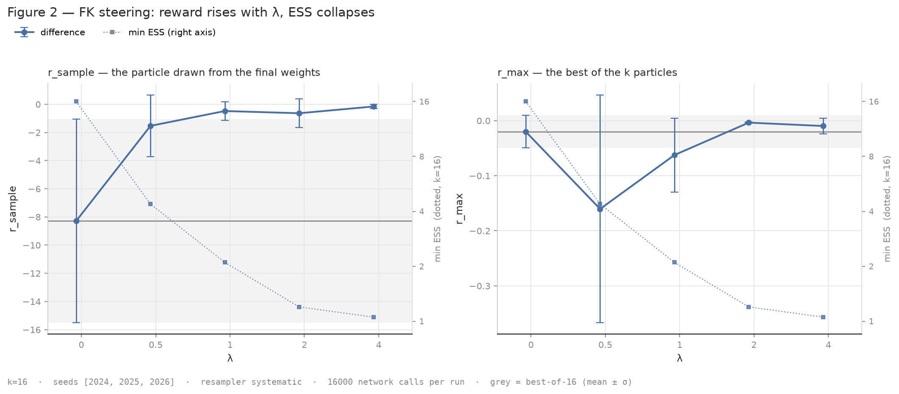
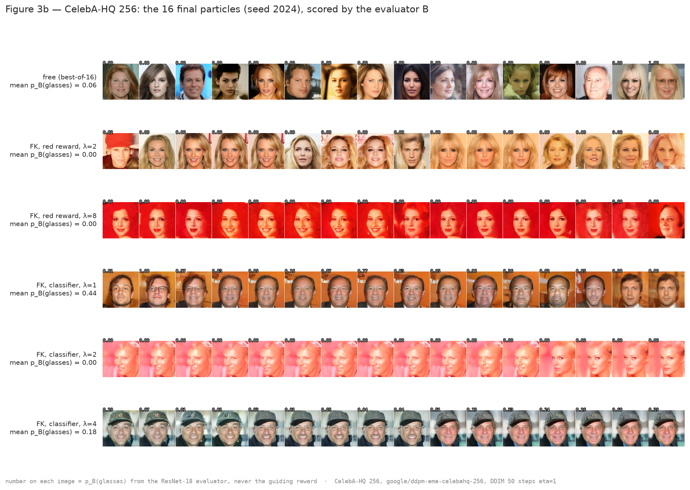

# Sequential Monte Carlo for diffusion models: FK Steering, then PG-DLM

Giulio Fogato, ENSAE Paris.

## Overview

Reproduction from the equations of two Sequential Monte Carlo methods for
guided sampling of diffusion models:

- **FK Steering** (Singhal et al., 2025): a particle filter along the denoising
  trajectory, with three intermediate potentials (`difference`, `max`, `sum`)
  that all target `p(x) exp(λ r(x))`.
- **PG-DLM** (Dang et al., 2025): Particle Gibbs on full trajectories, for
  masked diffusion language models. Coming next.

All the SMC is plain PyTorch, in `smc/`. Two base models share the same
schedule (linear β, T = 1000) and the same `step` / `predict_x0` interface:

- a DDPM trained here on CIFAR-10 (8.4M-parameter U-Net, `notebooks/demo_DDPM.ipynb`);
- `google/ddpm-ema-celebahq-256` from the Hub, 256 px faces, where the damage
  done by λ is visible to the eye.

### Results so far

The first reward is a deliberately simple "red" score. FK Steering pushes it up
with λ, and that is the problem: `sum` pushes it past its own bound, the images
leave [−1, 1], and at λ = 8 the CIFAR samples are flat red squares that the
judge B still gives a mean p(cat) of 0.43. A reward that can be gamed, and a
metric that follows it: the diagnosis of reward hacking
(`figures/fig2_sweep_lambda.png`, `figures/fig3_samples_by_reward.png`).

The classifier reward is the interesting part. `r(x) = log p_A(cat | x)` with A
a small VGG (89 %); with the `difference` potential the product telescopes to
`p(x) p_A(cat | x)^λ`, so λ = 1 is the Bayes posterior under A. A second
classifier B (ResNet-18, 93 %, calibrated) only judges and never guides.



CIFAR-10, k = 16, three seeds: the log-probability of the drawn particle goes
from −8.3 (free) to −0.5 at λ = 1 and −0.2 at λ = 4, while the minimum ESS
falls from 16 to 1. Judged by B, 10 of 16 final particles are cats at λ = 1
against 4 of 16 for the free model, on images that stay plausible.
Reference point: the DDPM fine-tuned on the cat class reaches FID 51.4 against
80.2 for the base model.



CelebA-HQ 256 with a glasses classifier as reward: λ = 1 puts glasses on 7 of
16 faces for B, on clean faces. From λ = 2 the ESS drops to 1, the sixteen
particles descend from one ancestor, and that ancestor was chosen on blurry
Tweedie estimates where A is fooled. Same failure as the red squares, visible
to the eye this time.

The FID says the same thing on 2048 images per lot, against two references: the
1468 faces with glasses, and all 30000 faces.

| | vs glasses | vs all faces |
|---|---|---|
| free model | 123.8 | 43.6 |
| FK glasses, λ = 1 | 65.1 | 52.6 |
| FK glasses, λ = 2 | 73.7 | 67.3 |

At λ = 1 the distance to the target is halved for nine points of global FID,
without retraining anything; on CIFAR, fine-tuning the whole DDPM on the cat
class bought a comparable gap (80.2 to 51.4). At λ = 2 both columns get worse.
The lots keep the sixteen particles of each run, duplication included, so these
are pessimistic bounds. Each choice behind these numbers is one entry of
`docs/decisions.md`.

## Getting started

### Code and environment

Python ≥ 3.11, plain `pip`. Two requirement files:

```bash
pip install -r requirements.txt && pip install -e .    # pinned, anywhere
pip install -r requirements-onyxia.txt && pip install -e .   # inside the SSP Cloud image, keeps its torch
```

The experiments ran on one Tesla T4 (16 GB). The 256 px model needs about
11 GB at k = 16 in fp16; the CIFAR model and the tests need much less. The
fast tests run on CPU:

```bash
pytest              # fast, no GPU, no weights
pytest -m slow      # full runs on the real model, needs the weights
```

On Onyxia, `scripts/onyxia_bootstrap.sh` brings an instance back to a working
state; `docs/ONYXIA_setup.md` says what survives a restart and what does not.

### Data and weights

Nothing heavy is in git. Everything lives in `/home/onyxia/work/ddpm/` and is
mirrored on an S3 bucket with `scripts/sync_s3.sh {push,pull,status}`:

| | |
|---|---|
| `weights/ddpm_last.pt`, `weights/ft_class3/` | CIFAR-10 DDPM, base and fine-tuned on class 3 (EMA and raw weights) |
| `weights/classifier_*.pt` | guides A (small VGG) and judges B (ResNet-18), CIFAR-10 and CelebA-HQ Eyeglasses |
| `dataset/` | CIFAR-10; CelebA-HQ 256 with its 40 attributes (arrow) and its 64 px uint8 cache |
| `hf/` | HuggingFace cache (`HF_HOME`), so the Hub model survives a restart |
| `fid/` | reference and generated PNGs, Inception statistics |

Sample tensors (`samples/*.pt`) are written next to each results JSON and are
git-ignored; the JSON records the path.

### Logging

No experiment tracker. Each run writes one flat JSON in `results/`, one record
per (method, potential, λ, resampler, seed) with the generator seed, so a single
cell can be replayed. Figures are rebuilt from those JSON files only.

## Reproduction

From the root, in this order. Each script says in its docstring which figure
it feeds.

```bash
# CIFAR-10, red reward
python -m experiments.run_free_samples            # results/free_samples_*.json   -> plot_fig0.py
python -m experiments.run_best_of_n               # results/bestofn.json           -> plot_fig1.py
python scripts/run_sweep_lambda.py                # results/sweep_lambda.json      -> plot_fig2.py

# CIFAR-10, classifier reward (target: cat)
python experiments/train_classifier.py --arch small --seed 0                 # guide A
python experiments/train_classifier.py --arch resnet18 --seed 1 --epochs 90  # judge B
python experiments/train_classifier.py --arch resnet18 --seed 1 --epochs 90 --calibrate
python scripts/run_sweep_lambda.py --reward classifier --lam 0 0.5 1 2 4 \
       --out results/sweep_lambda_classifier.json --save-images
python scripts/plot_fig3.py                       # figures/fig3_samples_by_reward.png
scripts/run_fid_all.sh                            # results/fid.json

# CelebA-HQ 256, Hub model (DDIM 50 steps, eta = 1)
python experiments/train_classifier.py --dataset celebahq --attr Eyeglasses --arch small --seed 0
python experiments/train_classifier.py --dataset celebahq --attr Eyeglasses --arch resnet18 --seed 1
python scripts/run_sweep_lambda.py --weights hub:google/ddpm-ema-celebahq-256 --steps 50 --eta 1 \
       --potentials difference --resamplers systematic --save-images --out results/sweep_lambda_hub_red.json
python scripts/run_sweep_lambda.py --weights hub:google/ddpm-ema-celebahq-256 --steps 50 --eta 1 \
       --reward classifier --target 1 --classifier-weights .../classifier_eyeglasses64_small_seed0.pt \
       --lam 0 0.5 1 2 4 --potentials difference --resamplers systematic --save-images \
       --out results/sweep_lambda_hub_classifier.json
python scripts/plot_grid.py --json results/sweep_lambda_hub_red.json --judge .../classifier_eyeglasses64_resnet18_seed1.pt

# what k buys at a matched budget
python scripts/run_sweep_lambda.py --reward classifier --k 2 4 8 16 --lam 0.5 1 2 \
       --potentials difference --resamplers systematic --save-images \
       --out results/sweep_k_classifier.json
python scripts/run_sweep_lambda.py --reward classifier --k 4 8 16 --lam 0.5 1 2 \
       --potentials max --resamplers systematic --save-images \
       --out results/sweep_k_max_classifier.json
python scripts/plot_fig5_k.py                     # figures/fig5_sweep_k.png

# SD v1.5 (separate venv, see scripts/setup_sd_env.sh)
HF_HOME=/home/onyxia/work/hf_cache python scripts/run_sd_baseline.py \
       --prompts data/imagereward-benchmark-prompts.json --seeds 2024 2025 2026
python scripts/plot_fig4_sd.py                    # figures/fig4_sd_ir_hps.png
python scripts/make_table_sd.py
```

`results/` and `figures/` in the repo are the outputs of these commands.

## Repository structure

```
smc/
  weights.py, resampling.py   normalised log-weights, ESS, resamplers (return indices)
  fk.py                       fk_steer, best_of_n, the three potentials
  models.py, scheduler.py     the DDPM behind step / predict_x0; DDPM and DDIM schedulers
  unet.py, ema.py             the CIFAR-10 network and its EMA
  pretrained.py               a Hub UNet behind the same interface
  rewards.py, classifier.py   red and classifier rewards; small VGG and ResNet-18
  rng.py                      one torch.Generator per run
experiments/                  training and sampling runs, JSON in results/
scripts/                      lambda sweep, FID, figures, Onyxia and S3 plumbing
tests/                        one property per test; `particles` is the oracle for the resamplers
docs/decisions.md             why each choice, one short entry each
docs/results.md               every measurement and what it cost on the T4
docs/protocol_sd.md           the SD run, written before it was launched
docs/ONYXIA_setup.md          bringing an ephemeral instance back
LEARNING.md                   the bugs that cost more than twenty minutes
notebooks/, third_party/      the DDPM training notebook; the MDLM checkpoint for PG-DLM
```

## License

MIT, see `LICENSE`.
