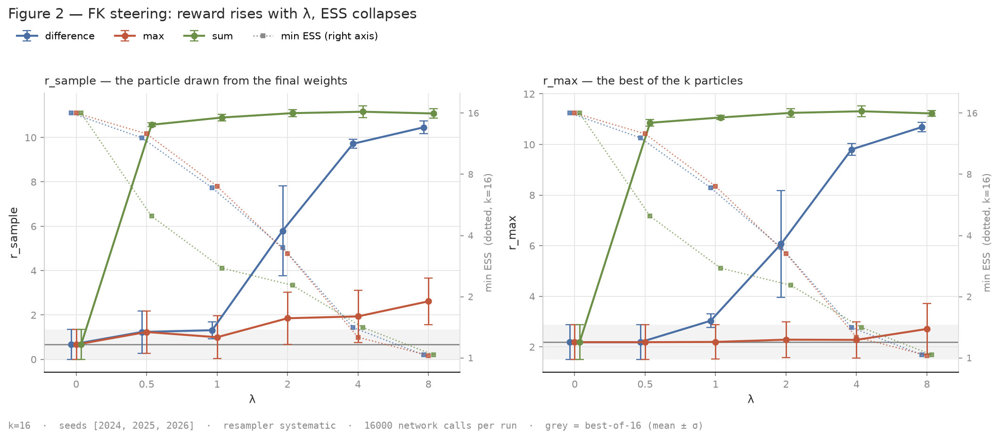

# Sequential Monte Carlo for diffusion models: FK Steering, then PG-DLM

Giulio Fogato — ENSAE Paris.

Reproduction from the equations of two Sequential Monte Carlo methods for
guided sampling of diffusion models:

- **FK Steering** (Singhal et al., 2025) — a particle filter along the
  denoising trajectory, with three intermediate potentials (`difference`,
  `max`, `sum`) that all target `p(x) exp(λ r(x))`.
- **PG-DLM** (Dang et al., 2025) — Particle Gibbs on full trajectories, for
  masked diffusion language models. Coming next.

The base model is a DDPM trained here on CIFAR-10 (8.4M-parameter U-Net,
T = 1000, `notebooks/demo_DDPM.ipynb`). All the SMC is plain PyTorch, in `smc/`.

## Results so far



With a deliberately simple "red" reward, FK Steering pushes the reward up with
λ; `sum` pushes it past its own bound — the images leave the [−1, 1] range.
That is the diagnosis of reward hacking, and the starting point of what
follows: a classifier reward, and an evaluation independent of the reward
(FID on the target class, a second classifier).

## Running

```bash
pip install -r requirements.txt && pip install -e .
pytest                 # fast, no GPU
pytest -m slow         # needs the weights (see below)

python scripts/run_sweep_lambda.py      # results/sweep_lambda.json
python scripts/plot_fig2.py             # figures/fig2_sweep_lambda.png
```

Weights and datasets are not in the repo: they live in `/home/onyxia/work/ddpm/`
and on an S3 bucket (`scripts/sync_s3.sh`). On Onyxia, `scripts/onyxia_bootstrap.sh`
brings an instance back to a working state (`docs/ONYXIA_setup.md`).

## Where things are

| | |
|---|---|
| `smc/weights.py`, `smc/resampling.py` | normalised log-weights, ESS, resamplers (return indices) |
| `smc/fk.py` | `fk_steer`, `best_of_n`, the three potentials |
| `smc/models.py`, `smc/scheduler.py`, `smc/unet.py` | the DDPM behind the `step` / `predict_x0` interface |
| `smc/rewards.py`, `smc/classifier.py` | rewards and CIFAR-10 classifiers |
| `experiments/`, `scripts/` | experiments (JSON in `results/`) and figures |
| `tests/` | one property per test; `particles` is the oracle for the resamplers |
| `docs/decisions.md`, `LEARNING.md` | why each choice; the bugs that cost more than twenty minutes |

MIT license.
