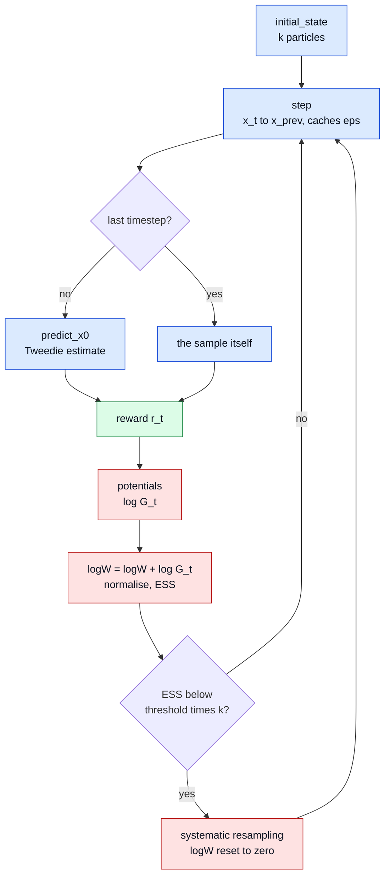
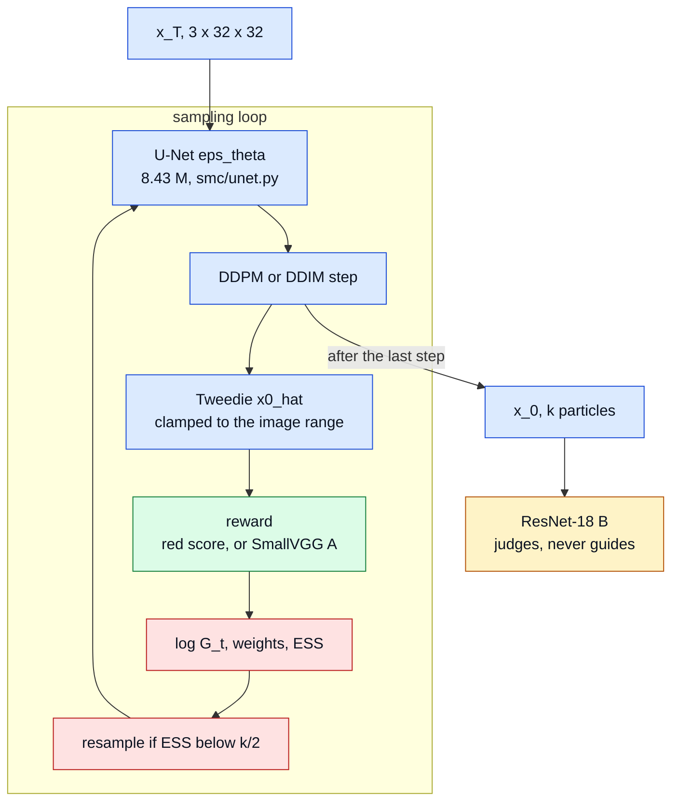
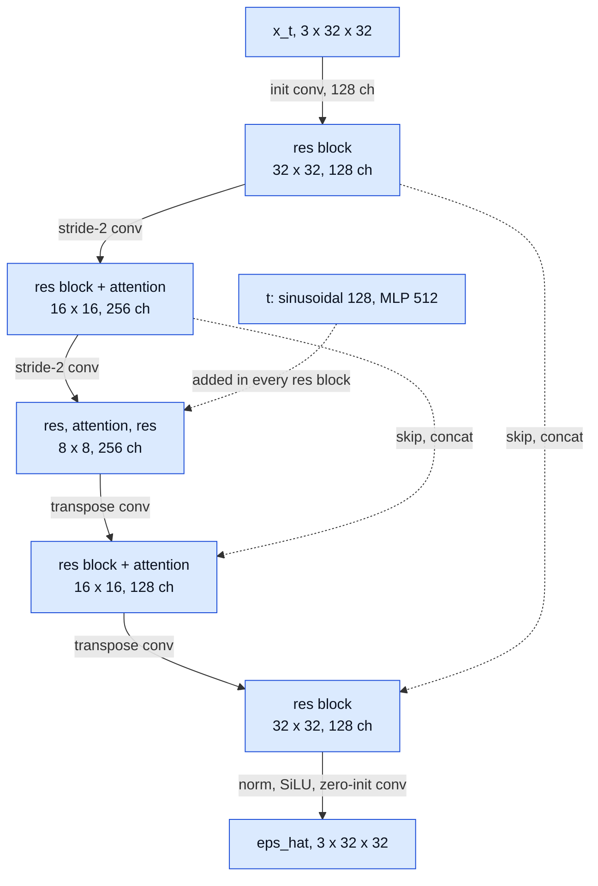
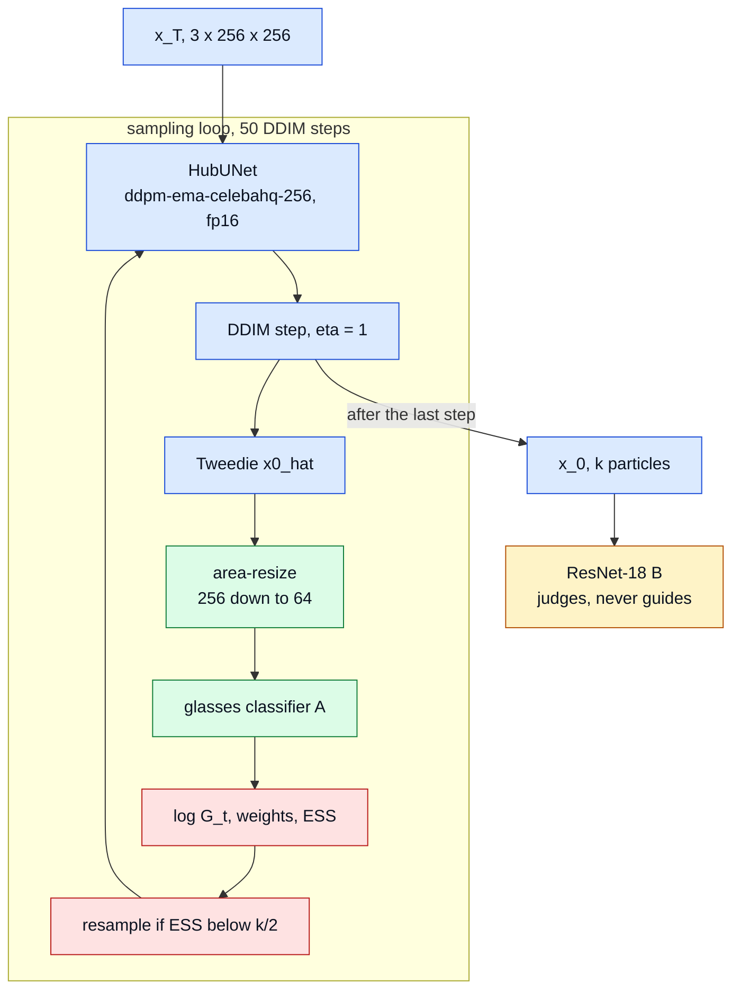
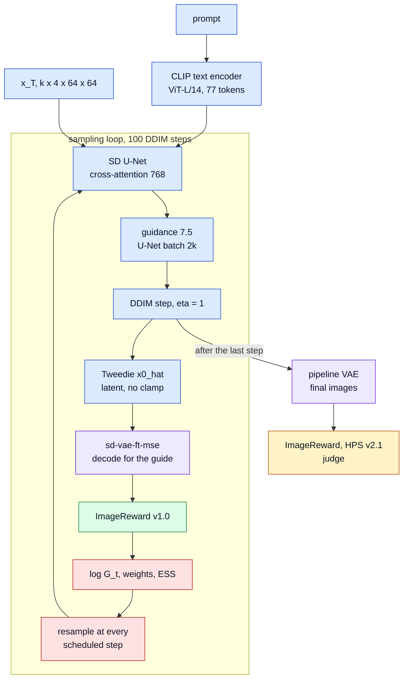
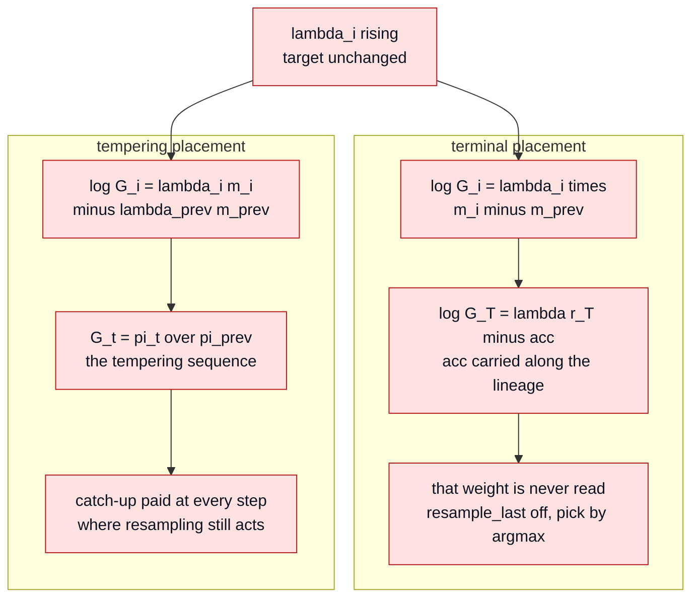

# Architecture: the networks, and the parameters attached to them

Three stacks run in this repository, and one sampler drives all three. What
changes from one to the next is the network that denoises, the network that
scores, and the space the two of them meet in. This file says what each network
is, where it runs, and which value every parameter takes. Why a value was chosen
is in `docs/decisions.md`; what it gave is in `docs/results.md`. The first
section states the method the sampler implements, with its source; the parameter
values it is run at are in "FK Steering, parameter by parameter" below.

## FK Steering, the method

The source for this section is Singhal et al., *A General Framework for
Inference-time Scaling and Steering of Diffusion Models*, ICML 2025,
arXiv 2501.06848, section 3 and algorithm 1. The repository's own choices are in
`docs/decisions.md`.

**The target.** A reward $r(x_0)$ says what a good sample is. The method does not
retrain the diffusion model; it samples from a tilted version of it:

$$p_{\text{target}}(x_0 \mid c) = \frac{1}{Z}\, p_\theta(x_0 \mid c)\,
\exp\big(\lambda\, r(x_0, c)\big).$$

$\lambda$ sets how hard the tilt pulls. At $\lambda = 0$ the target is the model
itself. Large $\lambda$ concentrates the target on rare high-reward samples.

**Why not plain importance sampling.** Draw $k$ samples from the model, then
resample them with weights $\exp(\lambda r(x_0^i))$. This is correct, and the
paper keeps it as the degenerate case, $G_t = 1$ for $t \geq 1$ and
$G_0 = \exp(\lambda r(x_0))$. It is also weak:
every sample is drawn blind, and a high-reward sample is rare under $p_\theta$,
so most of the budget is spent on particles that were never going to win.

**The Feynman-Kac construction.** Instead of scoring once at the end, score along
the way. The method defines a sequence of distributions over partial paths,
each one tilting the model by a *potential* $G_t$:

$$\pi_t^{\text{FK}}(x_T, \dots, x_t \mid c) = \frac{1}{Z_t}\,
p_\theta(x_T, \dots, x_t \mid c) \prod_{s=T}^{t} G_s .$$

One constraint makes this legitimate. The potentials must multiply, along a
whole path, to the tilt that was wanted in the first place:

$$\prod_{t=T}^{0} G_t = \exp\big(\lambda\, r(x_0, c)\big).$$

Any family of potentials satisfying it targets the same $p_{\text{target}}$. The
paper says so explicitly, and the repository's telescoping test is that sentence
turned into an assertion. What the choice changes is not the target but which
particles survive to the end, and therefore how many particles are needed.

**The algorithm.** Algorithm 1 of the paper, with $\tau$ the proposal that
extends a path by one step:

1. Draw $k$ particles $x_T^i \sim \tau$, and score them, $G_T^i$.
2. At each step $t$: **resample** $k$ indices with probabilities proportional to
   the $G_t^i$; **propose** $x_{t-1}^i \sim \tau(\cdot \mid x_t^i)$; **re-weight**,
   $G_{t-1}^i = \frac{p_\theta(x_{t-1}^i \mid x_t^i)}{\tau(x_{t-1}^i \mid x_t^i)}\,
   G_{t-1}(x_T^i, \dots, x_{t-1}^i)$.
3. Return the $k$ particles $x_0^i$.

The proposal here is the diffusion model's own transition kernel, which is the
paper's simplest choice. Then $p_\theta / \tau = 1$ and the importance ratio
disappears: the weight is the potential and nothing else. `smc/fk.py` cuts the
same cycle at a different point, propose then re-weight then resample, which is
the same loop read from one step later.

**The three potentials.** $r_\phi(x_t)$ is the reward read at an intermediate
state, $r(x_0)$ the reward at the finished sample.

| potential | $G_t$ for $t \geq 1$ | terminal $G_0$ | what it prefers |
|---|---|---|---|
| `difference` | $\exp\big(\lambda(r_\phi(x_t) - r_\phi(x_{t+1}))\big)$, $G_T = 1$ | telescopes on its own | particles whose reward is still rising |
| `max` | $\exp\big(\lambda \max_{s \geq t} r_\phi(x_s)\big)$ | $\exp(\lambda r(x_0)) \big(\prod_{t \geq 1} G_t\big)^{-1}$ | particles that peaked highest anywhere on the path |
| `sum` | $\exp\big(\lambda \sum_{s \geq t} r_\phi(x_s)\big)$ | $\exp(\lambda r(x_0)) \big(\prod_{t \geq 1} G_t\big)^{-1}$ | particles with the highest accumulated reward |

`difference` telescopes by construction: consecutive terms cancel and the
product collapses to the two ends of the path, $\exp(\lambda(r(x_0) -
r_\phi(x_T)))$. `smc/fk.py` starts its running gate at zero, which drops the far
end and leaves $\exp(\lambda\, r(x_0))$ exactly. `max` and
`sum` do not telescope, so the paper defines $G_0$ to divide out the running
product. That terminal factor is not an implementation detail. It is what keeps
all three on the same target, and it is why `fk_steer` refuses to run when the
resampling schedule omits the last step.

The paper reports a trade-off between the first two. `max` scores best on prompt
fidelity across the models it tests. `max` also costs diversity, because
resampling on a running maximum favours the leading particle more sharply than a
difference does. `difference` has the opposite weakness: a reward with a ceiling,
such as ImageReward on $[-2, 2]$, gives a particle that saturates early no
further increments to earn, so it is scored as if it had stalled. The SD runs
here use `max` and pay that diversity cost in full, one lineage out of four
(run 14 of `docs/results.md`).

**Interval resampling.** Between $x_t$ and $x_{t+1}$ little changes, so scoring
at every step buys little. The paper defines a resampling schedule
$R = \{t_r, \dots, t_1\}$ with $t_1 = 0$: off the schedule $G_t = 1$, on it the
potential is the real one. The terminal step is in $R$ by definition, which is
the same requirement as above seen from another side.

**The intermediate reward.** $r_\phi$ can be anything; the approximation stays
consistent. The choice used here, and the paper's own for its image
experiments, is to read the ordinary reward at the model's estimate of the
finished sample, $r_\phi(x_t) = r(\hat x_t)$ with
$\hat x_t \approx \mathbb{E}[x_0 \mid x_t]$. This is the Tweedie estimate,
`predict_x0` in the code and in the diagrams below. Early in the trajectory it is
close to noise. That is where the guidance is least reliable, and where the
particle cloud collapses in the runs here.

**Against best-of-N.** Best-of-$N$ draws $N$ independent samples and keeps the
one the reward likes best. It is the paper's baseline, and a fair one: at
$N = k$ both methods pay for $k$ trajectories. The difference is when the budget
is committed. Best-of-$N$ commits everything up front and selects once, at the
end, when nothing can be changed. FK Steering spends the same trajectories but
reallocates them during generation, dropping particles that look unpromising and
duplicating those that do. That reallocation is also its failure mode: a
duplicated particle is one lineage where best-of-$N$ still has $N$, which is the
collapse this repository measures.

Table 1 of the paper states the baseline as best-of-$N$ with four independent
samples, and says nothing about seeds. The appendix, where samples are shown
side by side, is where the two are compared on the same seed, "thus providing a
counterfactual generation". The protocol here pairs the seeds for every run and
matches the budget on U-Net rows rather than on calls (`docs/protocol_sd.md`).

**Where this repository departs from the paper.** Each line is a deviation to
declare, not a bug.

| | the paper | here |
|---|---|---|
| resampler | multinomial, in algorithm 1 | systematic, multinomial kept and compared (run 3) |
| when to resample | every step in algorithm 1, an adaptive rule in the appendix | every scheduled step at threshold 1.0, the $\mathrm{ESS}$ rule as a measured variant |
| `max` and `sum` potential | $G_t = \exp(\lambda S_t)$ | $G_t = \exp(\lambda(S_t - S_{t-1}))$, same target |
| decoder for $r_\phi$ on SD | not stated | `stabilityai/sd-vae-ft-mse` |
| $\lambda$ | constant | constant reproduced, time-dependent ramps measured |

One point is unresolved rather than chosen. The paper's appendix, "Adaptive
Resampling", defines $\mathrm{ESS}_t = 1/\sum_i (\widehat{G}_t^i)^2$ and then
writes that the resampling step is *skipped* when $\mathrm{ESS}_t < k/2$,
because that "encourages particle diversity". `smc/weights.py` implements the
opposite and standard rule: resample when the ESS has fallen below the
threshold, because a low ESS is what says the weights have degenerated. That is the rule in the two SMC references the paper itself cites,
Naesseth, Lindsten and Schön, *Elements of Sequential Monte Carlo* (2019), and
Chopin and Papaspiliopoulos, *An Introduction to Sequential Monte Carlo* (2020).
Which of the two readings the paper's released code applies has not been checked
here. `docs/protocol_potentials.md` carries both mismatches with their measured
impact.

A second point is unresolved in the same way, and it is about the potentials
themselves. The paper writes `max` as $G_t = \exp(\lambda \max_{s \geq t}
r_\phi(x_s))$, the running maximum itself. `smc/fk.py` computes the increment of
that running maximum, $\log G_t = \lambda\,(m_t - m_{t-1})$; `sum` likewise
reduces to $\log G_t = \lambda\, r_\phi(x_t)$. Both forms satisfy the product
constraint, so both target $\exp(\lambda\, r(x_0))$ and the telescoping test
passes under either. They differ in the weight a particle carries at a scheduled
step: $\exp(\lambda m_t)$ under the paper's form, $\exp(\lambda(m_t - m_{t-1}))$
under the code's. A particle that peaked early keeps the larger weight
indefinitely in the first and carries weight 1 in the second.

Read that way the three potentials of `smc/fk.py` are one family,
$G_t = \exp(\lambda(S_t - S_{t-1}))$ with $S_t$ the last reward, the running
maximum or the running sum. Their intermediate targets are
$\pi_t \propto p(x)\exp(\lambda S_t)$, which is the form `docs/protocol_sd.md`
derives under the name tempering, at constant $\lambda$. Which form the paper's
released code uses has not been checked here. What it costs, how to implement the
paper's form and the run that settles it are in `docs/protocol_potentials.md`.

## The contract the sampler asks for

`smc/fk.py` never names a model. It calls four things, declared in the
`DiffusionModel` ABC of `smc/models.py`: `timesteps`, `initial_state`, `step`
and `predict_x0`. The state that travels between them is a dict with four keys,
`{x, eps, x_t, t}`: the current sample, the noise the network predicted, the
sample that prediction was made from, and its timestep. `step` rewrites the four
as one block, so the cached triple is never stale when `predict_x0` reads it.

The six diagrams below share one colour code: blue for the generating path,
green for the network that guides, amber for the one that judges, violet for a
decoder, red for the SMC bookkeeping that belongs to no network.

Two points of that loop are where the reproductions went wrong once and are
worth naming here. At every step but the last the reward scores the Tweedie
estimate $\hat x_0 = (x_t - \sqrt{1-\bar\alpha_t}\,\hat\varepsilon)/\sqrt{\bar\alpha_t}$,
a blurred guess; at the last step it scores the sample itself, and that step
carries the corrective term that makes the three potentials share the target
$\exp(\lambda\,r(x_0))$. The terminal step is identified by position, the last of
`model.timesteps`, not by `t == 0`: SD v1.5 ships `steps_offset = 1` and its
timesteps end on 1, so a `t == 0` test would have silently changed the target
(`docs/decisions.md`, "Identifying the terminal step"). `fk_steer` refuses to run
if the resampling schedule does not contain that step.

`predict_x0` returns whatever the model's space is. On the pixel models it is an
image, clamped to $[-1, 1]$; on SD it is a latent and no clamp. The reward object
is what bridges the two, which is why no line of `fk.py` changed for SD.

## Stack 1: CIFAR-10 DDPM, 32 px, pixel space

**The generator.** `smc/unet.py`, trained here in `notebooks/demo_DDPM.ipynb`.
Encoder 32 to 16 to 8, one residual block per resolution and two in the
bottleneck, self-attention at 16 and at the 8-px bottleneck, GroupNorm with at
most 32 groups everywhere, and a zero-initialised output convolution so training
starts at $\hat\varepsilon = 0$.
The class default is `n_feat = 64`; the checkpoint carries `n_feat = 128`, which
is **8.43 M** parameters, the 8.4 M of the README. Time enters as a sinusoidal
embedding of width `n_feat`, an MLP to `4 * n_feat`, and one linear projection
per residual block.

| training | value |
|---|---|
| dataset | CIFAR-10, 50 000 images, normalised to $[-1, 1]$ |
| objective | MSE on $\varepsilon$ |
| optimiser | Adam, lr $2\cdot10^{-4}$, batch 128 |
| epochs | 200, about 4 h 15 on the T4 |
| precision | AMP fp16 at training, no bf16: Turing has no native bf16 |
| EMA | decay 0.999, `smc/ema.py`; sampled from the shadow weights from run 5 on, runs 1 to 3 used the raw weights |

**The noise schedule.** $T = 1000$, $\beta$ linear from $10^{-4}$ to
$2\cdot10^{-2}$, $\bar\alpha_t$ built as `cumsum(log alpha).exp()`.
`NoiseScheduler` walks all 1000
steps; `DDIMScheduler` takes a uniformly spaced sub-sequence of `steps`
timesteps and the $\eta$-parametrised reverse step of Song et al. 2021, eq. 12.
Uniform spacing is a deviation: the DDIM paper uses quadratic spacing on
CIFAR-10.

**The rewards.** The red score of `smc/rewards.py` is
$r(x) = (\bar x_R - \tfrac12(\bar x_G + \bar x_B))/0.1962$, deliberately gameable,
and it is gamed: `sum` pushes it past its own bound of 10.19 and the images leave
$[-1, 1]$. The classifier reward is $r(x) = \log p_A(\text{cat} \mid x)$, which
makes the `difference` potential telescope to $p(x)\,p_A(\text{cat}\mid x)^\lambda$,
so $\lambda = 1$ is exactly the Bayes posterior under A.

**Guide and judge.** Both in `smc/classifier.py`, both reading images in
$[-1, 1]$, both on GroupNorm so the batch statistics of a particle cloud never
enter. A is called at every step of the trajectory and is small; B is called once,
after the run, and is never in a potential.

| network | role | parameters | epochs | accuracy | temperature |
|---|---|---|---|---|---|
| `SmallVGG` (A) | guide | 1.15 M | 30 | 89.4 % | 1, raw logits |
| `ResNet18` (B) | judge | 11.2 M | 90 | 93.2 % | 1.82, LBFGS on the test set |

**FID.** `scripts/run_fid.py`, InceptionV3 pool3 features, 2048 dimensions,
through `pytorch-fid` 0.3.0. On CIFAR the lots are 2048 generated images, three
of them, against Inception statistics on 5000 class-3 and 10 000 test images.

## Stack 2: CelebA-HQ 256, the same code with a Hub network

CIFAR at 32 px hides what $\lambda$ does to an image, so the same sampler runs on
a 256 px model. `google/ddpm-ema-celebahq-256` shares the CIFAR schedule exactly
(linear $\beta$, $T = 1000$), which is why `smc/pretrained.py` is short: the
diffusers `UNet2DModel` is wrapped as `HubUNet`, a black box
$\varepsilon_\theta(x, t)$ under fp16 autocast, and `HubDDPM` subclasses
`CifarDDPM` to change nothing but the shape of the initial noise. fp16 cuts
memory from 8.3 to 5.4 GiB at batch 16 on the T4.

The resize is not a preprocessing step written into the pipeline: `Tempered.forward`
interpolates to the classifier's own `input_size` whenever the incoming image does
not match, so a 64 px classifier scores a 256 px sample without anyone converting
anything. Sampling is DDIM, 50 steps, $\eta = 1$; a $T = 1000$ run at 256 px would
cost minutes per particle set.

The Eyeglasses attribute has 4.9 % positives, so both networks are trained with
class-weighted cross-entropy at 64 px and recall is reported next to accuracy.

| network | role | accuracy | recall |
|---|---|---|---|
| small VGG (A) | guide | 98.4 % | 95.9 % |
| ResNet-18 (B) | judge | 99.0 % | 97.3 % |

## Stack 3: Stable Diffusion v1.5, latent space

This is the stack with the most networks, and the only one where the reward does
not live in the same space as the model.

**The generator.** `stable-diffusion-v1-5/stable-diffusion-v1-5`, fp16, `variant="fp16"`,
safety checker off. From the checkpoint configs: U-Net on 4-channel latents,
block widths 320 / 640 / 1280 / 1280, two layers per block, cross-attention
dimension 768; VAE encoder-decoder between 512 px RGB and a 4-channel 64 px
latent; text encoder a `CLIPTextModel`, 12 layers, 12 heads, hidden size 768, 77
positions. The scheduler is replaced at load time by
`DDIMScheduler.from_config(pipe.scheduler.config)`.

| parameter | value | where it is set |
|---|---|---|
| steps | 100 | `--steps` |
| guidance scale | 7.5 | `--guidance` |
| $\eta$ | 1.0 | `--eta` |
| image size | 512 px, latent 4 x 64 x 64 | `--size` |
| precision | fp16 | `torch_dtype` at load |

Classifier-free guidance doubles the batch the U-Net sees, so the forward hook
in `run_sd_baseline.py` logs `unet_batch = 2k`. The budget matching between FK
and best-of-$N$ is read on `n_unet_rows`, the sample rows that crossed the U-Net,
and not on `n_unet_calls`: the $k$ particles cross in one batched forward, so the
call counter reads 100 for every configuration while the rows read 200 for `k1`
and 800 for `bon4`. FK at $k = 4$ lands on 800 as well, one value across all 600
runs of the two, measured rather than derived. Wall clock is not matched by the
same act: 62.5 s per FK run against 56.1 s, the extra being the decodes and the
reward passes.

$\eta = 1$ is not cosmetic. At $\eta = 0$ two particles sharing $x_T$ are equal
bit for bit and resampling would clone particles that can never diverge; the
check in `docs/decisions.md` measures a relative difference of 1.74 at $\eta = 1$
against 0 at $\eta = 0$. The noise also follows the slot, not the lineage: one
generator draws one $(k, 4, 64, 64)$ tensor per step, so two clones get two
different slices.

The wrapper was checked against the pipeline before any of this ran:
`fk_steer` at $\lambda = 0$, $k = 1$, on the same prompt and seed, returns the
latent `pipe(..., output_type="latent")` returns, `torch.equal` true, maximum
absolute difference 0.0 on latents of scale 3.6.

**Two VAEs, on purpose.** The guide decodes with `stabilityai/sd-vae-ft-mse`, a
drop-in decoder on the same latent space, in chunks of 4 to keep the VRAM peak
flat at large $k$. The final images go through the pipeline's own VAE, so `k1`,
`bon4` and `fk4` are all judged on images from the same decoder and the fine-tuned
one only ever touched the guide. The paper does not say which decoder it used;
this is a deviation, and `docs/decisions.md` entry 6 records it as one.

**The reward that guides.** ImageReward v1.0, loaded with
`download_root=/home/onyxia/work/ir_cache` because `ImageReward.load` ignores
`HF_HOME` and would drop 1.7 GB on the ephemeral overlay. `ImageRewardSD` in
`smc/rewards_sd.py` decodes, converts to uint8 PIL, scores, and returns a tensor:
the VAE lives in the reward, not in the model, and that is what kept `fk.py`
untouched.

**The judges.** ImageReward again on the final images, and HPS v2.1, which never
enters a potential. The two scales have nothing in common: on thirteen images of
one prompt ImageReward spans 0.173 to 1.867 while HPS spans 0.2856 to 0.3429. At
$\lambda = 10$ a 1.7 point gap in ImageReward is a weight ratio of $e^{17}$, so
the ESS collapse is readable in the scales before any run. `div_clip` reuses the
HPS image encoder, a ViT-H/14, for mean pairwise cosine distance between the $k$
finals, and requires `hpsv2.score` to have run first so the weights are already
in memory.

## The networks, one row each

| network | role | identifier | size | precision |
|---|---|---|---|---|
| CIFAR U-Net | generator | `smc/unet.py`, `n_feat = 128` | 8.43 M | fp32 at sampling, AMP fp16 at training |
| CelebA-HQ U-Net | generator | `google/ddpm-ema-celebahq-256` | not stated in docs | fp16 autocast |
| SD U-Net | generator | `stable-diffusion-v1-5` | not stated in docs | fp16 |
| SD text encoder | conditioning | `openai/clip-vit-large-patch14`, 12 layers | not stated in docs | fp16 |
| SD VAE | decoder, final images | pipeline VAE | not stated in docs | fp16 |
| ft-mse VAE | decoder, guide only | `stabilityai/sd-vae-ft-mse` | not stated in docs | fp16 |
| SmallVGG | guide, CIFAR | `smc/classifier.py` | 1.15 M | fp32 |
| ResNet-18 | judge, CIFAR | `smc/classifier.py` | 11.2 M | fp32 |
| small VGG 64 px | guide, CelebA-HQ | `smc/classifier.py` | 1.15 M | fp32 |
| ImageReward v1.0 | guide, SD | `ImageReward-v1.0` | not stated in docs | not stated in docs |
| HPS v2.1 | judge, SD | `hpsv2`, ViT-H/14 | not stated in docs | fp32 |
| InceptionV3 | FID only | `pytorch-fid` pool3 | 2048 features | fp32 |

Parameter counts absent from both the checkpoint configs and the docs are marked
as absent. The MDLM checkpoint in `third_party/mdlm_hf` is installed and
generates text, and nothing in `smc/` reads it yet: it is the v2 stack, for
PG-DLM.

## FK Steering, parameter by parameter

The definitions behind these names are in "FK Steering, the method" above.

**On the two pixel stacks** the reward is cheap, so it is evaluated at every step
of the trajectory and the resampling rule is adaptive, $\mathrm{ESS} < k/2$.

| | CIFAR-10 | CelebA-HQ 256 |
|---|---|---|
| steps | $T = 1000$, full schedule | DDIM 50, $\eta = 1$ |
| $k$ | 16 in the sweeps, 2 to 16 in the $k$ study | 16, and 4 to 16 in the $k$ study |
| potentials | `difference`, `max`, `sum` | `difference` |
| $\lambda$ | 0, 0.5, 1, 2, 4, 8 on the red reward; up to 4 on the classifier | 0 to 8 red, 0 to 4 glasses |
| resampler | multinomial and systematic, compared | systematic |
| threshold | 0.5 | 0.5 |
| seeds | 2024, 2025, 2026 | 2024, 2025, 2026 |
| budget | matched on $k \times T$ U-Net calls, counted | 800 U-Net calls per run |

**On SD** the reward costs a VAE decode, so it is evaluated only at the scheduled
steps. The reproduction setting is the SD row of the paper's table 1.

| parameter | value | flag | why |
|---|---|---|---|
| $\lambda$ | 10 | `--lam` | the paper's value |
| potential | `max` | fixed in `sample_fk` | MAX as `smc/fk.py` computes it, corrective term included |
| $k$ | 4 | sampler name `fk4` | matched against `bon4` on U-Net rows |
| schedule | $t \in \{0, 20, 40, 60, 80\}$ | `--fk-schedule` | the paper's five steps |
| threshold | 1.0 | `--fk-threshold` | resample at every scheduled step |
| resampler | systematic | `resampler=`, no CLI flag | `fk_steer`'s default; multinomial agrees within seed noise (run 3) |
| `resample_last` | `False` | not exposed | the terminal weight is never read |
| final pick | argmax ImageReward | `main`, for `bon4` too | the table reports the selected particle, not the best HPS |
| $\lambda$ ramp | constant | `--fk-lam-schedule` | the paper |
| placement | terminal | `--fk-lam-placement` | only matters with a ramp |

**The schedule convention is a conversion, done once.** The paper counts in $t$
with 0 the terminal step; the loop counts in indices with 0 the first. The line
is `schedule = sorted(args.steps - 1 - t for t in args.fk_schedule)`, so at 100
steps $\{0, 20, 40, 60, 80\}$ becomes $\{19, 39, 59, 79, 99\}$. It is converted
at entry and written verbatim into every record as `schedule_idx`, because an
off-by-one done inside the loop survives a night of GPU.

**Off the schedule the potential is 1.** The reward is evaluated only at the
scheduled steps, which is the paper's interval resampling: five VAE decodes and
five reward evaluations per particle, twenty in all at $k = 4$, not four hundred.
The running max is then a max over a five-point grid and underestimates the max
over a hundred. That changes which particles are selected, not the target: the
terminal $G_0$ closes the product either way.

**Threshold 1.0 is not "no resampling", it is resampling at every scheduled
step.** `should_resample` fires whenever $\mathrm{ESS} < \text{threshold}\cdot k$,
and the ESS of a non-uniform weight vector is always below $k$. The 0.5 variant
is the $\mathrm{ESS} < k/2$ rule used on CIFAR and CelebA, and the gap between
the two is itself a measured result rather than a remembered setting, which is
why `schedule_mode` goes into every record.

**The screen's tags**, one JSON per variant under `results/sd_variants/`, all on
the first 20 prompts at seed 2024, so all sharing `sd_baseline.json`'s $x_T$ and
paired against it:

| tag | what changes |
|---|---|
| `S60`, `S40` | schedule truncated to $\{0,20,40,60\}$, $\{0,20,40\}$ |
| `S80` | one selection at $t = 80$, then four continuations |
| `D10` | ten scheduled steps, $\{0,10,\dots,90\}$ |
| `L2`, `L5`, `L20` | $\lambda$ = 2, 5, 20 |
| `A05` | threshold 0.5 |
| `K8` | $k = 8$, against `bon8` |
| `T1`, `T2` | linear and quadratic $\lambda$ ramp |
| `T1t`, `T2t` | the same ramps under tempering placement |
| `T1A05`, `T2A05`, `T1tA05`, `T2tA05` | ramp crossed with threshold 0.5 |

## The time-dependent $\lambda$

The constant $\lambda$ of the paper puts its full weight on the first scheduled
step, where the only thing to score is a Tweedie estimate at $t = 80$ that is
close to noise. The measured consequence is run 11 of `docs/results.md`, median
ESS 1.18 out of 4 at that first step, and run 14, where `fk4` ends on one lineage
out of four on all twenty prompts. A $\lambda$ that grows with the denoising
follows from the diagnosis: trust the reward less when the image is blurry.

**The ramp.** $\lambda_i = \lambda\,\rho\!\left(\frac{i+1}{\text{steps}}\right)$
with $\rho(p) = 1$, $p$ or $p^2$, built in `run_sd_baseline.py` over loop indices
and passed to `fk_steer` as `lam_schedule`. At the last index $p = 1$, so
$\lambda_T = \lambda = 10$ under all three: **the target $\exp(10\,r(x_0))$ does
not change**, only the path to it. At the paper's five steps this reads
$\lambda_i$ = 2, 4, 6, 8, 10 for the linear ramp and 0.4, 1.6, 3.6, 6.4, 10 for
the quadratic one. Constant passes no `lam_schedule` at all, so `fk_steer` keeps
its original code path byte for byte.

**Where the deficit is paid.** With $m_i$ the running max of the reward, a
constant $\lambda$ gives $\log G_i = \lambda\,(m_i - m_{i-1})$ in `smc/fk.py`
and the products telescope. A rising $\lambda_i$ leaves a deficit
$\sum_{i<T}(\lambda_T - \lambda_i)(m_i - m_{i-1})$, and the two placements differ
only in when it is settled.

$\lambda_{i-1}$ under tempering is the lambda of the previous scheduled step, a
scalar, and it is not resampled. `acc` under the terminal placement is an
integral along the lineage: it follows the resampling indices like `gate` and is
never reset, unlike `logW`. With a constant $\lambda$,
$\texttt{acc} = \lambda\,m_{T-1}$ and the old formula is the special case, which
is what the telescoping test checks.

**The consequence that has to be said out loud.** Under the terminal placement
the correction lands on a weight nothing reads, so the images of a `T1` run are
exactly those of a run with per-step $\lambda_i$ and no correction at all: a
weaker steering, not a reweighted one. Under tempering the catch-up is paid at
every scheduled step, where resampling can still act on it. `T1` against `T1t` on
the same $x_T$ isolates the placement and nothing else.

**What the eight ramps gave**, 20 prompts, seed 2024, paired against the `fk4`
reference of run 14 (full table and the ESS traces in run 15 of
`docs/results.md`):

| tag | placement | threshold | IR $-$ `fk4` | div_pix $-$ `fk4` | lineages / 4 |
|---|---|---|---|---|---|
| `T1` | terminal | 1.0 | +0.034 ± 0.053 | +0.007 ± 0.010 | 1.10 |
| `T1t` | tempering | 1.0 | +0.012 ± 0.048 | +0.036 ± 0.014 | 1.35 |
| `T1A05` | terminal | 0.5 | +0.033 ± 0.058 | +0.008 ± 0.012 | 1.25 |
| `T1tA05` | tempering | 0.5 | +0.002 ± 0.049 | +0.045 ± 0.016 | 1.55 |
| `T2` | terminal | 1.0 | −0.100 ± 0.092 | +0.048 ± 0.018 | 1.55 |
| `T2t` | tempering | 1.0 | +0.030 ± 0.054 | +0.050 ± 0.019 | 1.50 |
| `T2A05` | terminal | 0.5 | −0.023 ± 0.070 | +0.081 ± 0.017 | 1.95 |
| `T2tA05` | tempering | 0.5 | −0.034 ± 0.081 | +0.090 ± 0.018 | 2.05 |

On ImageReward all eight differences sit inside one standard error of zero: a
time-dependent $\lambda$ is not the lever for the reward. On the collapse it is,
through three linked steps: the ramp holds the ESS at
the first scheduled step above the threshold (2.88 measured for the linear ramp,
3.92 for the quadratic, against 1.18 for `fk4`), the threshold turns that into a
skipped resampling, and a skipped resampling is a lineage kept. `T2tA05` ends on
**2.05 lineages out of 4** and closes 38 % of the diversity gap to best-of-4, at
5 standard errors from zero.

Twenty prompts rank, they do not settle. Whichever variant goes to 100 prompts at
three seeds enters the table as a stated deviation from the paper's constant
$\lambda$, and `div_pix` is a pixel proxy: if diversity becomes the claim it
needs LPIPS or a CLIP distance behind it.

## What this file does not carry

Parameter counts for the SD components, ImageReward and HPS are not in the
checkpoint configs the repository reads, and are left out.
The CelebA-HQ U-Net is used as a black box and never counted. The PG-DLM stack
has no entry yet: `third_party/mdlm_hf` holds a checkpoint and no code in `smc/`
reads it.
