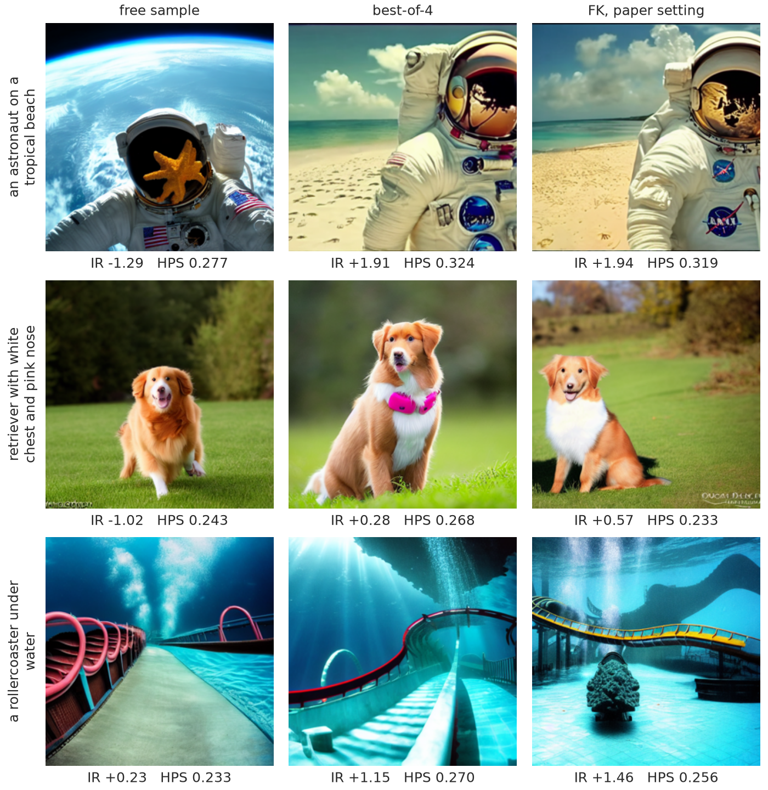
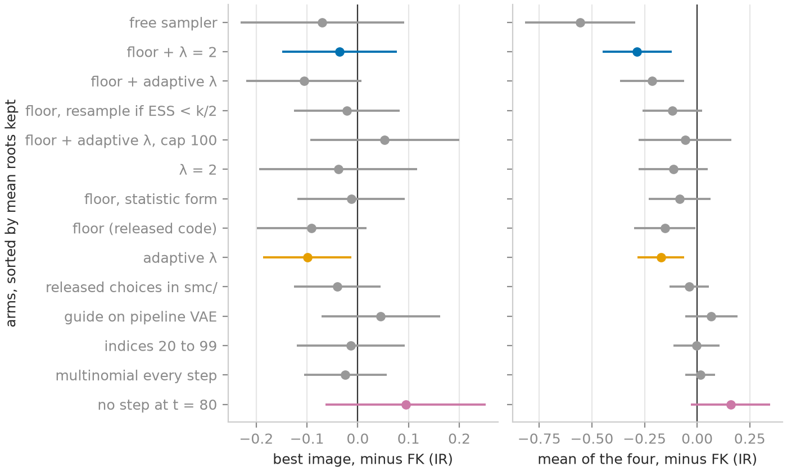

# Four particles, one image: reproducing FK Steering on Stable Diffusion, and what its gain over best-of-N buys

*Draft, pass 18 (25/09). Every number of the main text is printed by a script that
`scripts/post_numbers.py` runs, or stands in a dated block of `docs/results.md`.
Citations are `[@key]` and resolve in `docs/post/four-particles-one-image.bib`.*

## Context of the project

This is a solo project, done from August to 7 October 2026, the SMC part from 16 September, on a
shared GPU service that ran it on two GPU models in turn (section 9). I reimplemented FK Steering from its equations, ran its
Stable Diffusion experiment, and spent most of the time on why my numbers differ from the paper's. I
wrote the Sequential Monte Carlo core with the tests of its mathematics, and the analysis of the
collapse; an AI assistant wrote the launch and figure scripts and the documentation (section 10).

## TL;DR

FK Steering beats best-of-4 on Stable Diffusion v1.5 by less than the paper reports: +0.062 ± 0.026
ImageReward on 100 paired prompts against +0.161, while best-of-4 lands on the paper's value. At the
paper's setting the four images of a run descend from one initial noise in 93 to 96 runs of 100:
resampling weighs rewards read on a blurred image, and each pass removes lineages. Keeping three of
four, with λ = 2 and a floor on the reward, returns the best image to best-of-4's level and costs
0.250 ± 0.045 against FK on the mean of the four. Four runs of the released code under my launch
script, on the benchmark's first 40 prompts, land between -0.35 ± 0.09 and +0.10 ± 0.06 against
best-of-4, where this repository's filter with the same choices reads +0.108 ± 0.057.

## 1. What inference-time steering does to an image

Take one prompt and four initial noises. The free sampler turns the first noise into one image. Best-of-4
denoises all four and keeps the one ImageReward [@xu2023imagereward] scores highest, a learned
human-preference score that runs from about -2 to +2 on these prompts (A.1 defines each
metric). FK Steering denoises the four together and, up to four times on the way down, copies the promising
ones over the others.

From the prompt text alone I marked the 46 benchmark prompts of 100 that name something a reader can
check by eye and no artist or person. A rule then kept eight of those where FK beats best-of-4, ranked
by FK's margin over the free sample, at most two per subject category, plus the prompt closest to the
median and a typical loss (A.3). Figure 1 shows the best of three categories, so it shows what FK can
do: over the 46 prompts FK's median margin over best-of-4 is -0.024.

## 2. How FK Steering works

A diffusion model [@ho2020ddpm] denoises a Gaussian $x_T$ into a draw from $p(x)$. FK Steering
[@singhal2025fk] draws instead from

$$\pi(x) \propto p(x)\, e^{\lambda r(x)},$$

the model tilted toward a reward $r$, without retraining it. It runs $k$ particles down the trajectory
and, at a few scheduled steps, weights and resamples them: a high-weight particle is copied, a low-weight
one dropped. This is a Feynman-Kac particle system [@delmoral2004fk; @chopin2020smc].

The reward is defined on clean images and at step $t$ there is none, so it is read on the Tweedie
estimate $\hat x_0(x_t)$, the model's own guess of where the trajectory ends. At $t = 80$ of 100 that
guess is a blur.

The weights along a surviving lineage have to multiply to $e^{\lambda r(x_0)}$, otherwise the
particles target something other than $\pi$. The paper gives three potentials that satisfy this product
constraint. I use MAX, which weights a particle by the best reward its lineage has reached,
$G_t = \exp(\lambda\, \max_{s \ge t} r(\hat x_0(x_s)))$. The paper applies it as that statistic, I as
increments, each scheduled step paying the rise of the running maximum and the last step closing the
product; both target $\pi$, and on a 20-prompt screen the statistic reads 0.015 ± 0.009 above the increments on
the best image.

A **lineage**, or root, is the initial noise $x_T$ a final image descends from, found by walking the
ancestor indices backwards [@jacob2015path]. Four particles start from four roots, and each resampling
can drop some (figure 2).

The paper's appendix already reports the diversity cost, in its table of GenEval scores: on SD v1.5
(difference potential, 20-80-20 schedule) a CLIP diversity of the four finals of 0.104 at $\lambda = 10$ and 0.225
at $\lambda = 2$, against 0.312 for the base model, and on SD v1.4 a mean ImageReward over the four
particles of 0.811 against 0.927 for the best. Twisted SMC with a gradient-guided proposal
[@wu2024practical] appears in the paper as an instance of FK. This post adds the lineage count behind that diversity, its replay from the recorded weights, a
split of FK's gain, and the released code run under the paper's configuration.

## 3. The reproduction

I reproduce Table 1 of the paper on Stable Diffusion v1.5 [@rombach2022ldm]: DDIM [@song2021ddim] with
$\eta = 1$, 100 steps, guidance 7.5, 512 px, the 100 prompts of the ImageReward benchmark, $\lambda = 10$,
$k = 4$, MAX, scheduled steps $t \in \{80, 60, 40, 20, 0\}$. Two choices depart from the paper's text:
MAX as increments (section 2), and a systematic resampler (section 5) that runs only when the weights are
unequal, where Algorithm 1 draws a multinomial at every step (section 7). Three seeds per prompt, 300
runs per row; an FK run and the best-of-4 run of the same prompt and seed share their four initial
noises. HPS v2.1 [@wu2023hpsv2], a second preference model that nothing optimises, judges the image
ImageReward selected.

The project ran on two GPU models, an NVIDIA A2 and a faster card whose model was not recorded. These
900 runs used the faster card, by their seconds per run, and runs pair slot by slot only within one
machine (section 9).

| | ImageReward, best of $k$ | HPS v2.1 | ImageReward, mean of $k$ | paper (IR / HPS) |
|---|---|---|---|---|
| one sample | 0.237 ± 0.082 | 0.245 | 0.237 | 0.187 / 0.245 |
| best-of-4 | 0.758 ± 0.069 | 0.258 | 0.207 | 0.737 / 0.265 |
| FK, $k = 4$ | 0.820 ± 0.069 | 0.259 | 0.687 | 0.898 / 0.263 |

Intervals are standard errors over the 100 prompts, the seeds of a prompt averaged first. Against the
paper's values, from the same prompts, the spread that matters is that of a 100-prompt mean across
seeds, 0.013 for one sample, 0.038 for best-of-4 and 0.031 for FK: best-of-4 lands on the paper
(+0.021), one sample sits 0.050 above, four of its seed spreads, and FK 0.078 under; on HPS best-of-4
reads 0.258 against 0.265, for a seed spread of 0.001. The main comparison, the paper's own, set on
19/09 without a tolerance and so not a test, pairs the shared noises: FK gains +0.062 ± 0.026 over best-of-4, 69
prompts of 100 won, bootstrap interval [+0.009, +0.110], against the paper's +0.161. The three seeds
read +0.030 ± 0.037, +0.089 ± 0.034 and +0.068 ± 0.050 on their own.

A forward hook on the UNet counts 800 sample rows per run for FK and for best-of-4, 200 for one
sample. FK takes a median 62.5 s per run against 54.7 s, because it decodes and scores five times per
particle, so at equal time the baseline is best-of-4.57.

## 4. Four particles, one image

`n_lineages` counts the distinct roots among the four finals, and `div_pix` is their mean pairwise RMSE
at 64 × 64 (A.1). In a 100-prompt rerun on each machine,
FK at the paper's setting ends on one root in 96 runs of 100 on the A2 and 93 on the faster card (95 %
intervals [90, 98] and [86, 97]); on the faster card its `div_pix` is 0.109 ± 0.006, against 0.355 ±
0.005 for the free sampler on the same noises.

The best-of-$k$ metric cannot tell four near-copies of one image from four different images whose best
is that image. The mean of the four can: over the 300 runs of section 3, best-of-4's four free draws
average 0.207 and FK's four finals 0.687, +0.481 ± 0.030 paired, because FK's four are variations of
one image.

## 5. Two degeneracies, one ESS

The effective sample size, $\mathrm{ESS} = 1 / \sum_i w_i^2$ over the $k$ normalised weights
[@kong1994ess], equals $k$ under flat weights and 1 when one particle carries everything. On 100 runs
of FK at the paper's setting on the faster card, its median at the five scheduled steps reads 1.18,
1.63, 2.21, 3.29 and 2.71 of 4: at the first step one particle carries most of the weight.

At the first scheduled step the weight of a particle is $e^{\lambda r}$ up to a factor shared by the
four, so adding a constant to the four rewards changes nothing and only their spread matters. At
$t = 80$ the four guide rewards of a run span 0.905 on average (median 0.777). At $\lambda = 10$ the mean
is 9 nats between the largest and the smallest weight, on a reward read before the image has formed.

That first resampling already leaves 1.80 roots on the faster card and 1.68 on the A2, with 46 and 53
runs of 100 on one. A second degeneracy, of the paths, finishes the emptying: each resampling copies
some particles over others, and after a few passes every survivor descends from one ancestor, as long
as the weights are unequal when it resamples. Adaptive $\lambda$, which bisects $\lambda \le 10$ at
every step before the last to keep the ESS at 2 of 4 or above, still ends on 1.40 roots, 60 % of its
runs ([45, 74] %) on one (n = 40, a screen).

Given the log-weights a run recorded, the expected number of roots it ends on follows from the
resampler alone. The systematic resampler lays a comb of $k$ evenly spaced teeth, shifted by one uniform
draw, over the cumulative weights and copies the particle under each tooth, so the expectation averages
over that draw. It matches the observed mean of the eighteen steered arms I recorded (fourteen
variants, FK among them, and four 100-prompt reruns) within 0.09, fourteen of them within 0.05. This check
is conditional on the recorded weights: nothing in the steering removes lineages beyond what they and
the resampler imply.

The replay also forecast one variant before it ran (a test). From the weights of a variant that floors
the reward at 0 (section 6), resampling only under ESS $< k/2$ would end on 1.84 roots, 61 %
single-root and 1.12 resamplings; the run returned 2.00 ± 0.22, 62 % ([47, 76] %) and 0.97 (n = 40),
0.7 standard errors from the forecast.

## 6. What the target allows, and what diversity costs

Take best-of-4's four free draws and reweight them by $e^{10\, r}$: the median ESS over 100 prompts is 1.23. With the
base model as the proposal, four particles at $\lambda = 10$ cannot keep four lineages, whatever the
schedule or the resampler: a variant that keeps them returns particles the weights say to drop. A
proposal tilted toward the reward, like those the paper describes, would change that; I did not test
one.

Eight variants tried to keep the cloud alive, each with a prediction written before its results were
read (A.5) and
paired with FK on the same machine, on 20 to 100 prompts (A.2). The released code floors the running
maximum at 0, so a step where the four rewards are negative carries flat weights: that floor alone makes
the first step inert in 90 % of runs ([77, 96] %, n = 40) and ends on 1.73 roots: the collapse resumes
a step later. One variant meets the criterion fixed on 22/09, fewer than a quarter of runs on a single
root, which its 20-prompt screen already met: the floor with $\lambda = 2$. The 100-prompt rerun on the
faster card tested it: 3.03 roots of 4 and 4 % single-root ([2, 10] %), one point under the 5 to
10 % written before the run; its `div_pix` is 0.300
against 0.109 for FK. It gets there by changing the target, as the paper's appendix reports for $\lambda = 2$.

On the best image, six of the seven variants that change the weights (the eighth only drops the step at
$t = 80$) cannot be told from FK at 20 to 40 prompts, and adaptive $\lambda$ loses 0.099 ± 0.044
(screens): the 21/09 prediction that none would move it by more than one standard error missed (A.5).

Rerun on 100 prompts per machine, the floor with $\lambda = 2$ lands on the
best image that best-of-4 draws in the same process, +0.009 ± 0.012 on the faster card and +0.000 ±
0.018 on the A2, where FK reads
+0.021 ± 0.038 and +0.043 ± 0.038. At that n neither FK's edge nor the price of lineages on the best
image is resolved; against FK it reads -0.012, shallower than the band [-0.14, -0.02] written before
the run. On the mean of the four the price is clear: -0.250 ± 0.045 for the floor with
$\lambda = 2$ against FK (faster card, n = 100).

In the rerun on the faster card the free and FK
runs of a prompt share a process, so slot $j$ of the free run is what root $j$ becomes untouched (a
test, A.5). The four rewards at $t = 80$ rank the four free outcomes with a Kendall $\tau$ of +0.137 ±
0.050, and pick the best root in 35 % of prompts ([26, 45] %) against 25 % by chance. Read free, the
best root, the one best-of-4 returns, scores 0.779; an average root 0.233; the root FK keeps 0.466;
FK's best image from it 0.799. The early choice costs 0.313 ± 0.042. What follows returns 0.333 ±
0.038: 0.185 ± 0.036 as the rise of the mean of FK's four above their root, and 0.148 ± 0.011 as the
best-of-four read-out over near-copies.

## 7. The released code and the published gain

This repository follows the paper's text except in section 3's two choices, both screened: the increment
form and the comb, whose replacement by the multinomial
reads -0.024 ± 0.041 (n = 40). The released code [@fkd_code], run under the paper's configuration (its
own defaults differ, A.4), keeps the text's two choices and differs from this repository in four more:
a floor at 0 on the running maximum and a resampling of the final population under ESS $< k/2$, which
the text does not state, and the pipeline's VAE for the guide and indices one step later, where it
leaves room (A.4). Moved into this repository's filter one at a time (40-prompt screens) or together
(n = 100), none moves the best image by more than one standard error, 0.04 to 0.06 (A.2).

This repository's launch script resets the global seed per prompt, where the released launcher seeds
once per pass; under "generator" the initial and DDIM noises come from a generator passed to
the pipeline. The released code ran on the benchmark's first 40 prompts, where best-of-4 reads 0.846
against 0.770 on all 100, so every row below is read on those 40.

| row | code | n | ImageReward | against best-of-4 |
|---|---|---|---|---|
| paper, Table 1 | | | 0.898 | +0.161 |
| best-of-4, seed 2024 | `smc/` | 40 | 0.846 | |
| FK, seed 2024 | `smc/` | 40 | 0.921 | +0.075 ± 0.050 |
| FK with the released code's choices, final resampling aside | `smc/` | 40 | 0.954 | +0.108 ± 0.057 |
| released code, seed 2024, global seed | theirs | 40 | 0.949 | +0.103 ± 0.056 |
| released code, seed 2024, generator | theirs | 40 | 0.720 | -0.126 ± 0.070 |
| released code, seed 42, generator | theirs | 40 | 0.807 | -0.039 ± 0.073 |
| released code, seed 42, global seed | theirs | 40 | 0.497 | -0.349 ± 0.091 (-0.216 ± 0.061 on all 100) |

The seed-2024 runs start from best-of-4's noises; the seed-42 runs start from others and are
paired by prompt only. Without its filter the released code returns best-of-4's four rewards to the
fourth decimal, and its seed-2024 run under the global seed lands -0.004 ± 0.012 from this
repository's filter with the same choices. The two runs of one seed share their initial noises and
the DDIM noise up to the first resampling, after which each global-seed draw shifts the later noise.
They differ by -0.310 ± 0.077 at seed 42 and +0.229 ± 0.085 at seed 2024: the four means spread by 0.19
where the spread within a prompt predicts 0.07. I have not found why, in the released code or in the launch
script.

Before these runs I fixed the test that would close the gap: this repository's filter with the released
code's choices beating best-of-4 by +0.12 or more on the 100 prompts. It reads -0.011 ± 0.041, so the
gap stays open. The same filter reads +0.108 ± 0.057 on the first 40 and -0.090 ± 0.055 on the other 60:
the prompt set moves it more than the change of code does, and the released code's closest run sits 1.03 standard
errors under the paper's gain. I have not yet asked
the authors for the command and seeds behind Table 1, whether the floor was active, which VAE decoded
the guide, or which potential produced Table 1 (A.4); their answer could close part of the gap.

## 8. The same shape at three scales, and the judge

On CIFAR-10 (appendix A.6), with a cat classifier as reward, a second classifier counts 11 cats in 48
free finals and 37 at $\lambda = 4$ (three seeds pooled), as the minimum ESS falls from 16 to 1.05. On CelebA-HQ 256, with a glasses classifier as
reward, the judge sees glasses on 2 of 48 free faces, 21 at $\lambda = 1$ (7, 0 and 14 per seed) and none
at $\lambda = 2$, where one seed returns sixteen copies of one face. On SD the judge, HPS,
moves by +0.0015 ± 0.0011 between FK and best-of-4 (50 prompts of 100 won).

## 9. Limitations and open questions

The variants ran at one seed on 17 to 100 prompts; only the main table and the variant without the step
at $t = 80$ have three seeds. A rerun of six prompts on 23/09 replaced
their records of FK, the free sampler and floor + $\lambda = 2$: FK's were restored without their
weights, and A.2 reads the other two at 17 and 34 prompts.

The GPU changed under the project: an A2 at 88 to 90 s per run, and a faster card at 55 to 63 s. Within
one machine the runs reproduce slot by slot: on 23/09 the A2 returned the 21/09 reference on 100 of 100
prompts. Across machines the same code and noises give other
images, and FK keeps the same roots in 30 % of prompts ([22, 40] %), and its mean best image moves by
+0.026 ± 0.058 (n = 100).

The paper does not say which VAE decoded its guide's images, and the released code ran under this
repository's diffusers 0.31 rather than the commit it pins.

Nothing here covers $k = 16$ on SD, or a smaller $\lambda$ with more particles.

## 10. Reproducibility, and how this was made

The mathematics is tested as properties: along a surviving lineage the potentials multiply to
$e^{\lambda r(x_0)}$, and at $\lambda = 0$ the system is the free model. The resamplers are tested
against the `particles` library as an oracle. The collapse lab replays without a GPU from the
recorded runs, and every number of the main text is printed by a script that
`scripts/post_numbers.py` runs, or stands in a dated block of `docs/results.md`. Since 23/09 18:47
every run record names the process and the GPU it ran on. The repository holds the
dated predictions (A.5) and a log of every bug that cost more than twenty minutes.

I wrote the core, that is the weights, the resamplers, the three potentials, the Feynman-Kac loop and
the model wrappers, every test of a mathematical property, and the analysis of the collapse. An AI
assistant (Claude, from Anthropic) wrote the scripts that launch the experiments, the figure scripts
and the documentation; the working environment blocked it from editing the core.

## Appendix

### A.1 Glossary

**ImageReward (IR)** [@xu2023imagereward]. A learned scorer of text-to-image alignment and quality,
trained on human preference rankings; higher is better, typical range -2 to +2 on this benchmark.

**HPS v2.1** [@wu2023hpsv2]. A second human-preference scorer trained on a different dataset; used here
as a judge that was never optimised, read at the image ImageReward selected.

**Best of $k$, mean of $k$** (`ir_max`, `ir` mean). The best and the mean ImageReward over the $k$ final
images of a run. On a collapsed population the best scores one image; the mean scores the population.

**ESS** [@kong1994ess; @chopin2020smc]. Effective sample size of $k$ normalised weights, $1/\sum w_i^2$;
$k$ under flat weights, 1 when one particle carries all the mass.

**Lineage, root** [@jacob2015path]. The initial noise $x_T$ a final image descends from, recovered by
walking the ancestor indices backwards; `n_lineages` counts distinct roots among the $k$ finals.

**Systematic resampling, comb.** $k$ evenly spaced points shifted by one uniform draw over the
cumulative weights; each point copies the particle it falls on. Under flat weights it copies every
particle once.

**`div_pix`.** Mean pairwise RMSE between the $k$ finals downsampled to 64 × 64; separates four copies
from four images and nothing more.

**UNet rows.** The compute unit: sample rows crossing the UNet, counted by a forward hook; FK and
best-of-4 both read 800 per run, one sample 200.

**FID** [@heusel2017fid]. Fréchet distance between Inception features of two image sets; CIFAR and
CelebA only.

**Paired difference.** Computed per prompt (and per seed) on runs that share their $x_T$, then averaged;
the standard error is over prompts, the seeds of a prompt averaged first. Runs at another seed (section
7's seed-42 runs) are paired by prompt only. A slot or root comparison is made only between runs of one
machine.

**Screen, test.** A screen ranks variants on 20 to 40 prompts without settling them; a test confronts a
prediction written before the run, on the prompts the prediction names.

### A.2 All variants

The runs fall in named sessions. The probe (`collapse_lab/probe.py`) runs the variants with every weight
recorded. Session A: its first arms (`ctl`, `adapt`, `fadapt`, `floor`, `lam0`, half of `lam2` and
`floor2`), run on 22/09 morning on the A2; the other arms ran on the faster card. Session C
and session D: FK at the paper's setting (`ctl`), the free sampler (`lam0`) and floor + λ = 2 (`floor2`)
on 100 prompts in one process each, on the faster card (23/09) and on the A2 (23-24/09); session D also
saved every image and Tweedie estimate. Each variant is paired by prompt, seed 2024, with FK at the
paper's setting run on the same machine: session C on the faster card (100 prompts, equal to the FK row
of section 3 at that seed to 5e-5), session A on the A2 (40 prompts), from `collapse_lab/out/probe.json`
and `probe_C.json` (`collapse_lab/r_solutions.py`, `p_two_rewards.py`). Mean ± standard error over
prompts.

| variant | what | machine | n | single-root | roots | `div_pix` | best of 4, minus reference | mean of 4, minus reference |
|---|---|---|---|---|---|---|---|---|
| `late` | no step at t = 80 | A2 | 100 | 84 % | 1.16 | 0.107 | +0.041 ± 0.037 | |
| `adapt` | λ lowered by bisection to keep ESS ≥ k/2 before the last step, capped at 10 | A2 | 40 | 60 % | 1.40 | 0.153 | -0.099 ± 0.044 | -0.171 ± 0.056 |
| `floor` | floor at 0 (released code) | A2 | 40 | 68 % | 1.73 | 0.150 | -0.091 ± 0.055 | -0.153 ± 0.075 |
| `lam2` | λ = 2 | both | 40 | 35 % | 1.82 | 0.205 | -0.039 ± 0.079 | -0.113 ± 0.084 |
| `fadapt` | floor + bisected λ | A2 | 40 | 30 % | 2.12 | 0.200 | -0.106 ± 0.058 | -0.214 ± 0.078 |
| `floor2` | floor + λ = 2 | both | 34 | 6 % | 2.94 | 0.283 | -0.036 ± 0.058 | -0.285 ± 0.084 |
| `thr05` | floor, resample only if ESS < k/2 | fast | 40 | 62 % | 2.00 | 0.172 | -0.021 ± 0.053 | -0.118 ± 0.072 |
| `rise` | floor, bisected λ, cap 100 | fast | 20 | 35 % | 1.95 | 0.170 | +0.053 ± 0.075 | -0.058 ± 0.113 |
| `lam0` | free sampler | A2 | 17 | 0 % | 4.00 | 0.338 | -0.070 ± 0.082 | -0.557 ± 0.133 |
| `stat0` | floor, statistic form | fast | 40 | 62 % | 1.75 | 0.155 | -0.013 ± 0.054 | -0.083 ± 0.074 |
| `multi` | multinomial at every step | fast | 40 | 100 % | 1.00 | 0.074 | -0.024 ± 0.041 | +0.014 ± 0.037 |
| `vae` | guide decoded by the pipeline VAE | fast | 40 | 95 % | 1.05 | 0.087 | +0.045 ± 0.059 | +0.067 ± 0.063 |
| `idx` | indices {20, 40, 60, 80, 99} | fast | 40 | 100 % | 1.00 | 0.088 | -0.014 ± 0.054 | -0.003 ± 0.056 |
| `R1` | the four above together | fast | 100 | 81 % | 1.19 | 0.105 | -0.040 ± 0.043 | -0.038 ± 0.048 |

`late` is `results/sd_s60_full.json` at seed 2024 against the 21/09 reference, both on the A2; over
its three seeds against the 20/09 row it reads +0.0386 ± 0.0351, a comparison paired by prompt across
two machines. F7 draws the probe's own `late` arm instead (20 prompts, fast card, +0.094 ± 0.080).
The floor with resampling only under ESS < k/2 (`thr05`) resamples once per run and ends on 2.00 roots:
when the threshold fires, the accumulated weights are peaked and one pass takes almost everything. The
table of section 3, session C, `R1`, `idx`, `late` (probe), `multi`, `rise`, `stat0`, `thr05` and `vae`
ran on the faster card; the 21/09 reference, `sd_s60_full.json`, session A (`ctl`, `adapt`, `fadapt`,
`floor`, `lam0`) and session D on the A2; `lam2` and `floor2` half on each. The per-prompt gain of
section 3 has a heavy left tail: its worst prompt over three seeds is at -1.30 against best-of-4.
`lam2` and `floor2` ran half on each machine, each half against its own reference. `vae` keeps the same
set of roots as its reference in 78 % of prompts, `multi` and `idx` in 70 %. Session C
(`probe_C.json`, one process, 100 prompts): `ctl` 1.07 roots, 93 % single-root, `div_pix` 0.109;
`floor2` 3.03 roots, 4 %, 0.300, best of 4 minus `ctl` -0.012 [-0.082, +0.060], mean of 4 minus `ctl`
-0.250 ± 0.045; `lam0` 4 roots, 0.355. Session D (`collapse_lab/out/session_D/probe_D.json`, the A2,
one process, 100 prompts, images and Tweedie estimates saved): `ctl` 1.04 roots, 96 % single-root,
`div_pix` 0.094; `floor2` 2.96 roots, 4 %, 0.293, best of 4 minus `ctl` -0.043 ± 0.037, mean of 4 minus
`ctl` -0.261 ± 0.043; `lam0` 4 roots, 0.354. The mean of the four for the three rows of section 3
(0.237, 0.207, 0.687) is printed by `scripts/make_table_sd.py` from `results/sd_baseline.json`.

### A.3 The prompts shown as images

Rule in `docs/visual_selection.md`, with its amendment of 23/09: the selection is read from session D,
the one session that saved every image and Tweedie estimate (`data/visual_selection.json`, 46 complete
eligible prompts of 46, none replaced). `free` is slot 0 of the free sampler, `bo4` the best of its four
slots, `fk` the best of FK's four, all on the same noises. Five of the eight gains differ from the
selection the same rule returned on session C, on the other machine
(`data/visual_selection_pre_amendment.json`), as predicted.

| role | id | prompt | fk − free | fk − bo4 | roots FK / floor2 |
|---|---|---|---|---|---|
| gain | 001227-0027 | footage of an astronaut in a tropical beach | +3.22 | +0.03 | 1 / 2 |
| gain | 010361-0095 | retro sci fi art of an astronaut next to jupiter in a car | +1.81 | +0.24 | 1 / 2 |
| gain | 010525-0074 | a nova scotia duck tolling retriever with white chest and pink nose... | +1.59 | +0.29 | 1 / 4 |
| gain | 000304-0153 | chicken | +1.41 | +0.29 | 1 / 3 |
| gain | 007171-0104 | a bag of frozen breaded scampi with maerl spilling out | +1.31 | +0.73 | 1 / 4 |
| gain | 008265-0060 | a coin bag item from a videogame ui | +1.30 | +1.27 | 1 / 4 |
| gain | 007187-0044 | an underwater rollercoaster, cinematic, dramatic, - | +1.24 | +0.31 | 1 / 2 |
| gain | 007654-0033 | wood logs in the shape of a square | +1.21 | +0.66 | 1 / 4 |
| median | 008614-0134 | a checoslovaquian wolfdog, black and white painting | +0.57 | -0.03 | 1 / 3 |
| loss | 009606-0136 | logo for a coffee chain | +0.28 | -0.18 | 1 / 1 |
| worst loss | 002870-0080 | a modern style living room in a big mansion next to a giant window... | -0.68 | -0.81 | 1 / 3 |

The eligibility list (46 eligible in six categories: object, animal, scene, food, vehicle, figure; 54
excluded with a reason code) was written from the prompt text alone on 23/09, after the rewards of
the 20/09 runs on the same prompts had been read;
one prompt missed by the first pass was classified on 23/09, still from its text. The prompt that
started the project, "funny peanut butter" (`010856-0009`), is not selected; chosen by hand, it reads
fk − free -0.03 and fk − bo4 -0.36 in session D, with one root for FK and for floor + λ = 2.

### A.4 The reference configuration

| item | paper (text) | released code (defaults, or `launch.sh`) | this repository |
|---|---|---|---|
| model, sampler | SD v1.5, DDIM η = 1, T = 100, CFG 7.5 | SD v1.5 at `--model_idx` 4 to 7, fp16 (default SD 2.1; `launch.sh` names SDXL, but with no `--model_idx` the override sets SD 2.1 and k = 2); DDIM η = 1, T = 100, CFG 7.5 | SD v1.5, DDIM η = 1, T = 100, CFG 7.5, fp16 |
| reward | ImageReward on $\hat x_0$ | decoded by the pipeline VAE | decoded by `sd-vae-ft-mse` |
| λ, k | 10, 4 | `--lmbda 10`; k set by `--model_idx % 4` (4 at index 6) | 10, 4 |
| schedule | {0, 20, 40, 60, 80}, 0 terminal | default 5-30-5; `launch.sh` {20, 40, 60, 80, 99} | indices {19, 39, 59, 79, 99} |
| potential | MAX, as the statistic $\exp(\lambda \max_{s \ge t} r)$ | default DIFFERENCE; `launch.sh` MAX | MAX, increment form (the statistic 0.015 ± 0.009 above it, n = 20) |
| max statistic | not floored | floored at 0, carried through resampling | no floor |
| terminal step | closes the product | plus adaptive resampling if ESS < k/2 | never resampled |
| resampler | multinomial at every step (Algorithm 1) | multinomial at every scheduled step | systematic comb, only if ESS < k |
| prompts | ImageReward benchmark | `benchmark_ir.json`, 100 | byte-identical ids, order, text |
| seeds | not stated | `manual_seed` once per pass, 42, 43, 44 | one generator per prompt |

The runs of section 7 pass the paper's configuration to the released code (SD v1.5, λ = 10, k = 4,
MAX, 20-80-20) through this repository's launch script, `collapse_lab/ref/run_authors.py`, which
reseeds per prompt and replaces the unused LLM grader with a stub. Sources cell by cell, with file and
line numbers of the paper source and the released repository: `docs/reference_config.md`. Under flat
weights the comb is the identity and the multinomial draw of the released code is not: four flat
multinomial passes at $k = 4$ leave 1.58 roots by chance alone. The runs of section 7 cover the
benchmark's first 40 prompts, except the seed-42 run under the global seed, which covers the 100.

The potential of Table 1. The paper's text gives MAX for Table 1. Its appendix table of ImageReward
and HPS by $\lambda$ and schedule (Table "Effect of $\lambda$ and resampling schedule on diversity")
follows the sentence "Here we use the difference potential"; its FK rows at $\lambda = 10$ and
20-80-20 on SD v1.4, v2.1 and SDXL carry Table 1's FK ImageReward to the third decimal (0.927, 1.006,
1.298), and its base rows Table 1's best-of-4 (0.800, 0.888, 1.236). The HPS values differ (0.259,
0.266, 0.297 against 0.263, 0.268, 0.302), and SD v1.5 is not in that table. In this repository the
two potentials differ by -0.004 ± 0.024 on the best image (max minus difference, n = 20).

### A.5 Predictions written before the runs, and their outcome

The predictions with a number of `docs/protocol_sd.md` (dated sections); of `collapse_lab/FINDINGS.md`
section 7 (21/09, before the runs were read) and section 12 (undated, first in git on 22/09 06:22 UTC,
written before its runs were read); and of `collapse_lab/ASSESSMENT.md` (22/09 18h30, written with
`adapt`, `floor` and `fadapt` at 40 prompts and `floor2`, `lam2` and `lam0` at 20 already on disk).
Outcomes against the reference of the same machine.

| written | prediction | outcome |
|---|---|---|
| 21/09 | `late` − FK at 100 prompts × 3 seeds: above +0.052 kept, between 0 and +0.052 not settled | +0.0386 ± 0.0351, not settled |
| 19/09 | the SD v1.5 row of Table 1 as the target, no tolerance written | best-of-4 +0.021 from the paper, one sample +0.050, FK −0.078; FK − best-of-4 +0.062 ± 0.026 against +0.161 |
| 21/09 | `S80` (one step, t = 80) clearly below FK, not within one standard error; `D10` (ten steps) no gain over FK (20 prompts) | −0.027 ± 0.061: missed; +0.028 ± 0.088: held |
| 21/09 | HPS within ± 0.01 of FK whatever ImageReward does | held (`late` − FK, +0.0017 ± 0.0014) |
| 21/09 | FK: about 1.8 roots after t = 80 and 1.05 at the end | 1.74 and 1.06 (n = 40): held |
| 21/09 | FK in the probe equal on the best image to the FK row of section 3 at seed 2024 | equal to the 21/09 reference instead (the two ran on different machines): missed |
| 21/09 | `floor`: first step inert in about 90 % of runs, about 3.8 roots after it | 90 %, 3.83: held |
| 21/09 | `floor` ends on 2 to 3 roots | 1.73: missed |
| 21/09 | `lam2`: about 2.9 roots after t = 80, 1.3 to 1.6 at the end | 3.00: held; 1.82: missed |
| 21/09 | `floor2`: about 4.0 roots after t = 80 | 3.97 (n = 34): held |
| 21/09 | `lam0`: four roots, its four rewards equal to best-of-4's slot by slot | four roots: held; median slot gap 1.27 (another machine): missed |
| 21/09 | no variant moves the best image by more than one standard error from the reference | `adapt` −0.099 ± 0.044, `fadapt` −0.106 ± 0.058: missed |
| 22/09, § 12 | `adapt`: bisected λ near 4 at t = 80, 2.5 to 2.9 roots after it, 1.5 to 2 at the end | λ median 3.53: held; 2.45 and 1.40: missed |
| 22/09, § 12 | `fadapt`: at least 3 roots after t = 60 | 3.35: held |
| 22/09 18h30 | `floor2` at 40 prompts: under 10 % single-root, 2.6 to 2.9 roots, best image −0.10 ± 0.06 from FK | 6 %: held; 2.94: missed; −0.036 ± 0.058 (n = 34): missed on the shallow side |
| 22/09 18h30 | `lam2` at 40 prompts: 30 to 45 % single-root, 1.7 to 2.0 roots | 35 %, 1.82: held |
| 22/09 18h30 | `late` 1.4 to 1.8 roots, 40 to 70 % single-root | 1.00 at 20 prompts, 1.16 and 84 % at 100: missed |
| 22/09 18h30 | `late`'s best image within one standard error of FK | +0.041 ± 0.037 (n = 100): held |
| 22/09 18h30 | no variant at λ = 10 under 25 % single-root | lowest 30 % (`fadapt`): held |
| 22/09 | released code under the paper's configuration: 0.77 [0.72, 0.82] | 0.554 at its seed (n = 100): missed |
| 22/09 | released code − best-of-4 in [−0.05, +0.05] | −0.216 ± 0.061 (n = 100): missed |
| 22/09 | `R1` − reference −0.08 ± 0.05, 1.0 to 1.3 roots | −0.040 ± 0.043, 1.19 roots: held |
| 22/09 | `stat0` − reference −0.09 ± 0.05 | −0.013 ± 0.054: missed |
| 22/09 | `multi` − reference −0.02 ± 0.04 | −0.024 ± 0.041: held |
| 22/09 | `rise` 2.0 to 2.3 roots, − reference −0.05 ± 0.07 | 1.95 roots, +0.053 ± 0.075: missed |
| 22/09 | latents test: the free wrapper and best-of-4 diverge slot by slot (chaotic at η = 1) | correlation 0.984 or more at the last step: missed |
| 22/09 | gap closed only if `R1` − best-of-4 ≥ +0.12 | −0.011 ± 0.041: not closed |
| 22/09 | `R1` − released code within ± 0.03 (above 0.06, the codes differ in an unlisted choice) | +0.206 at seed 42: missed |
| 22/09 | released code returns fewer than four distinct images in 20 to 50 % of runs | 8 %: missed |
| 22/09 | `idx` − reference under 0.03 in absolute value | −0.014 ± 0.054 against the same machine: held; −0.051 as first read across machines |
| 22/09 | `vae` keeps the reference's roots in at least 70 % of prompts | 78 % against the same machine: held; 30 % as first read across machines |
| 22/09 | released code through a generator − `R1` within ± 0.05 | −0.147: missed |
| 22/09, 19h35 | `thr05` 2.4 to 2.8 roots, 1.2 to 1.8 resamplings (a guess, replaced at 19h55) | 2.00, 0.97: missed |
| 22/09, 19h55 | `thr05` 1.84 roots, 61 % single-root, 1.12 resamplings (coalescence replay) | 2.00 ± 0.22, 62 %, 0.97: held, 0.7 standard errors off |
| 23/09 | the two loops see the same first-step rewards within 0.05 | missed: the decoder moves one reward by 1.2 |
| 23/09 | released code at seed 2024 through a generator: − best-of-4 within ± 0.06, − `R1` within ± 0.08 | −0.126 and −0.233: missed |
| 23/09 | session C: `floor2` − reference in [−0.14, −0.02] on the best of 4 | −0.012 [−0.082, +0.060]: missed on the shallow side |
| 23/09 | `floor2` 2.8 to 3.1 roots, 5 to 10 % single-root | 3.03, 4 %: roots held, single-root missed by one point |
| 23/09 | Kendall τ under 0.15; A − B in [0.25, 0.50] | +0.137 ± 0.050; +0.313 ± 0.042: held |
| 23/09 | free sampler of session C slot-correlated with best-of-4 under 0.7 | 1.00: missed (same machine) |
| 23/09 | released code at seed 2024 under its own seeding in [0.55, 0.75] | 0.949: missed on the high side |
| 23/09 18h47 | session D, the A2: 80 to 95 s per run, `ctl` equal to the 21/09 reference on at least 95 of 100 prompts | 88.3 s, 100 of 100: held |
| 23/09 18h47 | session D's `lam0` slot-correlated with session C's at 0.99 or more | 0.62: missed, the free path does not cross machines |
| 23/09 18h47 | session D: `floor2` − `ctl` in [−0.10, +0.08]; 2.8 to 3.2 roots | −0.043 ± 0.037, 2.96: held |
| 23/09 18h47 | t = 80 thumbnails of the three arms equal to 1/255 | 0/255: held |
| 23/09 18h47 | the selection read on session D changes at least 3 of the 8 gains | 5: held |
| 23/09 19h03 | HPS, `ctl` − best-of-4 at the image ImageReward selects, within ± 0.01 | −0.003 ± 0.002: held |

### A.6 CIFAR-10 and CelebA-HQ

CIFAR-10, k = 16, T = 1000, three seeds, classifier reward $\log p_A(\text{cat} \mid x)$, DIFFERENCE
potential (`results/sweep_lambda_classifier.json`):

| λ | log-probability of the drawn particle | minimum ESS | cats by $B$ (of 48) | pixel distance |
|---|---|---|---|---|
| 0 | −8.29 | 16 | 11 | 0.339 |
| 0.5 | −1.53 | 4.4 | | |
| 1 | −0.48 | 2.1 | 15 | 0.231 |
| 2 | −0.64 | 1.2 | 32 | |
| 4 | −0.16 | 1.05 | 37 | 0.183 |

CelebA-HQ 256, k = 16, DDIM 50, glasses reward (`results/sweep_lambda_hub_classifier.json`,
`results/fid.json`): glasses by $B$ 2, 18, 21, 0, 2 of 48 at λ = 0, 0.5, 1, 2, 4 (at λ = 1, 7, 0 and 14
per seed); minimum ESS 2.2 at λ = 1, 1.18 at 2, 1.002 at 4 (means over the three seeds); at λ = 2 the sixteen finals of seed 2024
are copies of one blurred face that the guide $A$ scores as wearing glasses and the judge $B$ does not. FID
of 2048 finals against the 1468 faces with glasses 123.8 (free), 65.1 (λ = 1), 73.7 (λ = 2), against
the 30 000 faces 43.6, 52.6, 67.3. The reference point for FID is the CIFAR DDPM fine-tuned on the cat
class: 51.4 against 80.2 for the base model.
