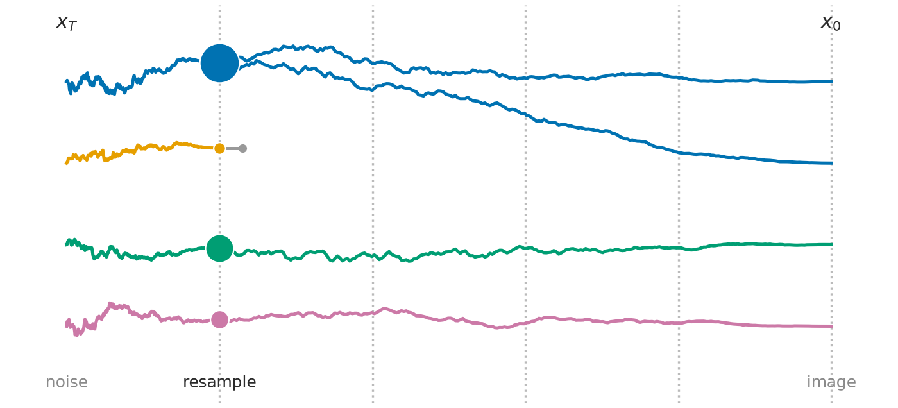
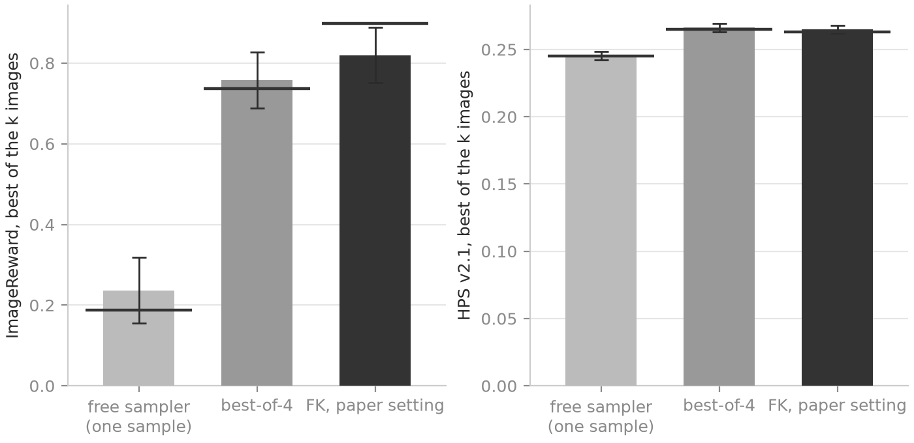
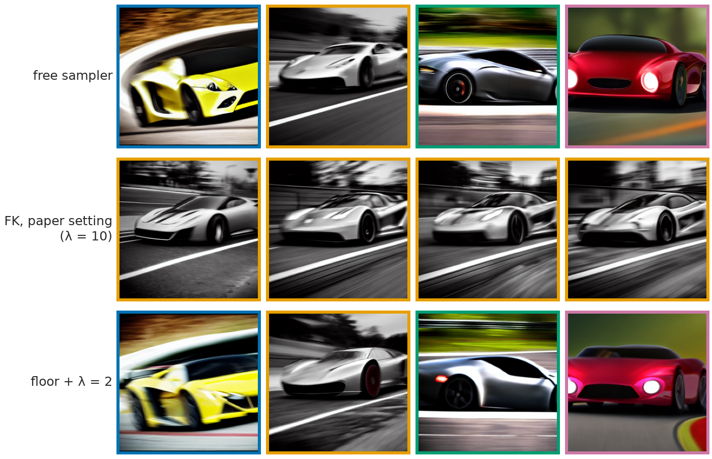
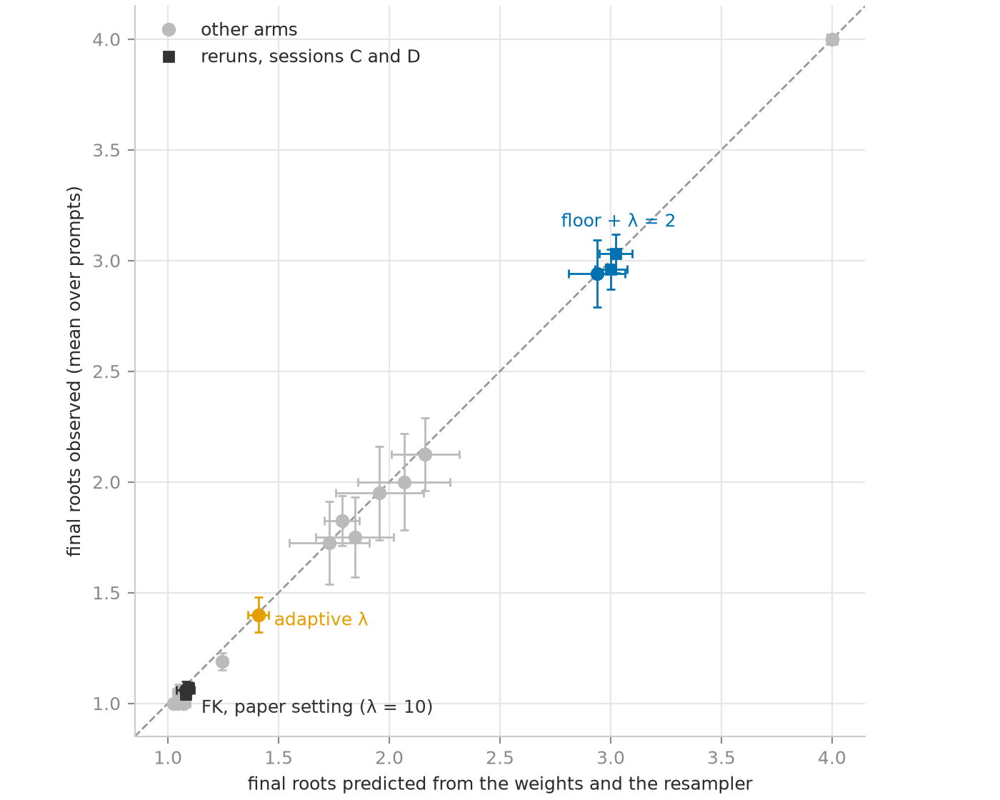

# Four particles, one image: reproducing FK Steering on Stable Diffusion, and what its gain over best-of-N buys

## Context of the project

This is a solo project, from August 2026 to its submission on 7 October; the SMC part started on 16
September. It ran on a shared GPU service that switched between two GPU models (section 10). I
reimplemented FK Steering from its equations, ran its Stable Diffusion experiment, and spent most of
the time on why my numbers differ from the paper's. I wrote the Sequential Monte Carlo core with the
tests of its mathematics, and the analysis of the collapse; an AI assistant wrote the launch and figure
scripts and the documentation (section 11).

## TL;DR

FK Steering beats best-of-4 on Stable Diffusion v1.5 by less than the paper reports: +0.062 ± 0.026
ImageReward on 100 paired prompts, against +0.161. Best-of-4 itself lands within one seed spread of the
paper's value.

The four images FK returns are nearly always one image. At the paper's setting they descend from a
single initial noise in 93 to 96 runs of 100. Each resampling drops some of the four noises, and the
first one weighs rewards read on a still-blurred image.

Keeping the noises has a price. Flooring the reward at 0 with λ = 2 keeps three noises of four: the
best image stays at best-of-4's level, and the mean of the four falls 0.250 ± 0.045 below FK's.

The authors' released code, run through this repository's launcher under the paper's configuration on
three seeds, does not close the gap. It gains -0.003 ± 0.025 over best-of-4, and +0.074 ± 0.023 in its
version from before a later fix. On those runs, two of whose three seeds ran on a second GPU model, this
repository's FK gains +0.080 ± 0.023.

## 1. What inference-time steering does to an image

Take one prompt and four initial noises. The free sampler turns the first noise into one image.
Best-of-4 denoises all four and keeps the one scored highest by ImageReward [@xu2023imagereward], a
learned human-preference score that runs from about -2 to +2 on these prompts (A.1). FK Steering
denoises the four together and, up to four times on the way down, copies the promising ones over the
others.

These are favourable cases, chosen among the prompts where FK beats best-of-4 (A.3). Over all 46 eligible prompts, FK's median margin
over best-of-4 is -0.024.

## 2. How FK Steering works

A diffusion model [@ho2020ddpm] denoises a Gaussian $x_T$ into a draw from $p(x)$. FK Steering
[@singhal2025fk] draws instead from

$$\pi(x) \propto p(x)\, e^{\lambda r(x)},$$

the model tilted toward a reward $r$, without retraining it. It runs $k$ particles down the trajectory
and, at a few scheduled steps, weights and resamples them: a high-weight particle is copied, a
low-weight one dropped. This is a Feynman-Kac particle system [@delmoral2004fk; @chopin2020smc].

The reward is defined on clean images, and at step $t$ there is no clean image. So it is read on the
Tweedie estimate $\hat x_0(x_t)$, the *guide*: the model's own guess of where the trajectory ends. At
$t = 80$ of 100 that guess is a blur.

The weights along a particle's chain of ancestors have to multiply to $e^{\lambda r(x_0)}$; otherwise
the particles target something other than $\pi$. The paper gives three potentials that satisfy this
product constraint. I use MAX, which weights a particle by the best reward its ancestors have reached,
$G_t = \exp(\lambda\, \max_{s \ge t} r(\hat x_0(x_s)))$. The paper weights each scheduled step by $G_t$
itself. I weight it by the ratio of $G_t$ to its value at the previous step, and set the last step's
weight so that the product along a lineage is $e^{\lambda r(x_0)}$. Both target $\pi$; on 20 prompts
the paper's form reads 0.015 ± 0.009 above mine on the best image (a screen, section 3).

A **lineage**, or root, is the initial noise $x_T$ a final image descends from, found by walking the
ancestor indices backwards [@jacob2015path]. Four particles start from four roots, and each resampling
can drop some (figure 2).

The paper's appendix already reports a diversity cost. On SD v1.5 (the schedule of section 3,
difference potential) the CLIP diversity of the four finals is 0.104 at $\lambda = 10$ and 0.225 at $\lambda = 2$,
against 0.312 for the base model. On SD v1.4 the mean ImageReward of the four particles is 0.811,
against 0.927 for the best. This post counts the lineages behind that diversity, forecasts one
variant's count before it ran, splits FK's gain, and runs the
authors' released code under the paper's configuration.

## 3. The reproduction

I reproduce the ImageReward and HPS columns of Table 1 on Stable Diffusion v1.5 [@rombach2022ldm], not
its GenEval column, with the paper's configuration: DDIM [@song2021ddim] with $\eta = 1$, 100 steps,
guidance 7.5, 512 px, the 100 prompts of the ImageReward benchmark, $\lambda = 10$, $k = 4$, MAX,
scheduled steps $t \in \{80, 60, 40, 20, 0\}$. Two choices depart from the paper's text: MAX as
increments (section 2), and a systematic resampler (the comb, A.1) that runs only when the weights are
unequal, where Algorithm 1 draws a multinomial at every step (section 7). Three seeds per prompt give
300 runs per row. An FK run and the best-of-4 run of the same prompt and seed start from the
same four noises. HPS v2.1 [@wu2023hpsv2], a second preference model that no sampler here steers
toward, is read on the best of the $k$ images, as the released evaluation reads it (the other reading
in A.4).

Conventions: ± is a standard error over prompts, seeds averaged first; [a, b]
is a 95 % interval, bootstrap for a difference and Wilson for a proportion. A comparison is a *test*
when A.5 lists a prediction with a tolerance written before the run, and a *screen* otherwise.

These 900 runs used an NVIDIA T4, inferred from their run times (A.5).
The project also ran on an A2, and I pair runs only within one machine (section 10).

| | ImageReward, best of $k$ | HPS v2.1, best of $k$ | ImageReward, mean of $k$ | paper (IR / HPS) |
|---|---|---|---|---|
| one sample | 0.237 ± 0.082 | 0.245 ± 0.003 | 0.237 | 0.187 / 0.245 |
| best-of-4 | 0.758 ± 0.069 | 0.266 ± 0.003 | 0.207 | 0.737 / 0.265 |
| FK, $k = 4$ | 0.820 ± 0.069 | 0.265 ± 0.003 | 0.687 | 0.898 / 0.263 |

How far is this from the paper? The paper does not state its seeds, so the yardstick is how far a
100-prompt mean moves from one seed to another. Pooled over the prompts, that spread is 0.063 for one
sample, 0.034 for best-of-4, 0.040 for FK and 0.039 for FK's gain over best-of-4. The unit of
comparison is that spread times $\sqrt{4/3}$ if Table 1 is one seed, or $\sqrt{2/3}$ if it averages
three. In this unit one sample and best-of-4 sit within one unit of the paper, and FK sits 1.7 or 2.4 under.
HPS lands within 0.002 of the paper on all three rows.

The paper's own comparison, FK against best-of-4 on the same noises, gives +0.062 ± 0.026: 69 prompts
of 100 won, [+0.009, +0.110]. That is 2.2 units under the paper if Table 1 is one
seed, and 3.1 if it averages three, as the released launcher's seeds 42 to 44 suggest (A.4); 1.7 and 2.6 if the paper's two rows
did not share noises. I set this
target before the runs but without a tolerance, so it is a screen.

FK also costs time. It sends the same 800 sample rows per run through the UNet as best-of-4 (A.1), but
decodes and scores each particle five times: a median 62.5 s per run against 54.7 s. At equal time the
baseline would be best-of-4.57.

## 4. Four particles, one image

FK's four finals are almost always one image. I count the distinct roots among them, and their
`div_pix`, the mean pairwise RMSE at 64 × 64 (A.1). In a 100-prompt rerun on each machine at the
paper's setting, FK ends on a single root in 96 runs of 100 on the A2 and 93 on the T4 ([90, 98] and
[86, 97]). With the released code's multinomial draw at every step instead of the comb, all 40 runs of
40 do (`multi`, A.2). On the T4, FK's `div_pix` is 0.109 ± 0.006, against 0.355 ± 0.005 for the free
sampler on the same noises.

The best-of-$k$ metric cannot see this. It scores four near-copies of one image the same as four
different images whose best is that image. The mean of the four can: over the 300 runs of section 3,
best-of-4's four free draws average 0.207 and FK's four finals 0.687, +0.481 ± 0.030 paired (a screen).

## 5. Why the particles collapse

The collapse happens in two stages: one extreme weighting at the first resampling, then a slower loss
of paths at the next ones. The effective sample size, $\mathrm{ESS} = 1 / \sum_i w_i^2$ over the $k$
normalised weights [@kong1994ess], equals $k$ under flat weights and 1 when one particle carries all the
weight. Over 100 runs of FK at the paper's setting (T4), its median is 1.18 of 4 at the first scheduled
step and 1.63 to 3.29 at the next four.

The first step is extreme because its weight is $e^{\lambda r}$ up to a shared factor, so only the
spread of the four rewards matters. At $t = 80$ they span 0.905 on average: at $\lambda = 10$, 9 nats
between the largest and the smallest weight, on a reward read before the image has formed. That first
resampling leaves 1.80 roots on average, and a single root in 46 runs of 100 (T4; the A2 in A.2).

The later resamplings finish the job. Each copies some particles over others, and after a few passes
every survivor descends from one ancestor, as long as the weights are unequal when it resamples.
Lowering $\lambda$ on the fly does not stop this. Adaptive $\lambda$, which bisects $\lambda \le 10$ at
every step before the last to keep the ESS at 2 of 4 or above (adaptive tempering [@chopin2020smc]),
still ends on 1.40 roots, one root in 60 % of its runs ([45, 74] %, n = 40), under the 1.5 to 2
predicted (a test, missed, A.5).

The root count depends only on the weights and the resampler, so its expected value can be replayed from
the recorded log-weights without a GPU [@jacob2015path]. On eighteen steered configurations the replay
matches the observed mean within 0.09, a check of the bookkeeping. It also forecast one variant before
it ran: with the reward floored at 0 (section 6), resampling only under ESS $< k/2$ [@chopin2020smc]
would end on 1.84 roots. The run returned 2.00 ± 0.22 (n = 40), and the criterion written with the
forecast, near 1.8 and not near the 2.6 first guessed, held (A.5).

## 6. What the target allows, and what diversity costs

Part of the collapse is in the target itself. Take best-of-4's four free draws, one per root, and
reweight them by $e^{10\, r}$: the median ESS over 100 prompts is 1.23 of 4. If one draw stands for its
root's expected weight, the target at $\lambda = 10$ puts most of its mass on one of four roots drawn
from the base model. A single draw per root also carries its own noise, which $e^{10 r}$ amplifies, and
I did not separate the two.

Eight variants tried to keep several roots, each paired with FK on one machine on 20 to 100
prompts (A.2, predictions in A.5). The first is the released code's floor: it floors the
running maximum at 0, so a step where the four rewards are negative carries flat weights. That floor
makes the first step inert in 90 % of runs ([77, 96] %, n = 40), but the collapse resumes a step
later: 1.73 roots at the end, under the 2 to 3 predicted (a test, missed).

One variant keeps the roots: the floor with $\lambda = 2$. Its criterion, fewer than a quarter of runs
on a single root, was written after its 20-prompt screen read 5 % and before its 100-prompt run on the
T4. That run gives 3.03 roots of 4 and 4 % of runs on a single root ([2, 10] %), one point under the 5
to 10 % written before it; its `div_pix` is 0.300 ± 0.008 against FK's 0.109. It needs both parts: $\lambda = 2$
alone leaves 35 % of runs on one root and the floor alone 68 % (A.2). Lowering $\lambda$ changes the
target. In 17
of the 100 prompts it never resamples and returns the free sampler's four images; these are half of
its four-root runs.

What does keeping the roots cost? On the mean of the four, a clear -0.250 ± 0.045 against FK (a
screen). On the best image, 100 prompts cannot tell: floor + λ = 2 reads -0.012 [-0.082, +0.060]
against FK, shallower than the -0.14 to -0.02 written before the run (a test, missed). It sits +0.009 ± 0.012
above the free sampler's best image of the same T4 run, where FK sits +0.021 ± 0.038 (the
A2 rerun in A.2).

Where does FK's gain come from? In that session the free and FK runs of a prompt ran in one process from
the same four noises, so free image $j$ shows what root $j$ becomes without steering. The four rewards at $t = 80$ rank these
four outcomes poorly: a Kendall $\tau$ of +0.137 ± 0.050 (a test, held), and the best root ranked first
in 35 % of prompts ([26, 45] %) against 25 % by chance. Read on the free outcomes (n = 100):

| | ImageReward |
|---|---|
| the best of the four roots (the free sampler's best image in this session, A.2) | 0.779 |
| a root drawn at random | 0.233 |
| the root FK keeps | 0.466 |
| FK's best image, grown from that root | 0.799 |

The root choice costs 0.313 ± 0.042 against the best root (a test, held). What follows returns 0.333
± 0.038: 0.185 ± 0.036 as the mean of FK's four rising above their root, and 0.148 ± 0.011 as the
best-of-four read-out over near-copies. Cost and return nearly cancel: FK's best image ends +0.021 ± 0.038
above the best root. This split was measured at seed 2024 only, where FK gains least over best-of-4
(+0.030; +0.089 and +0.068 at the other seeds, A.2).

## 7. The released code and the published gain

The authors' code does not close the gap either. I ran it [@fkd_code] through this repository's
launcher under the paper's configuration (A.4). It differs where the text is
silent or leaves room:

- it keeps the text's weighting by $G_t$ itself and its multinomial draw, which this repository replaces (section 3);
- it floors the running maximum at 0, which the text does not state;
- it resamples the final population when ESS $< k/2$, where the paper's appendix writes "if ESS $< k/2$, then we skip the resampling step";
- it decodes the guide with the pipeline's VAE, and sets its indices one step later.

`R1` moves all these choices but the final resampling into this repository's FK loop; it reads -0.040
± 0.043 against FK (a test, held; each alone in A.2). A fix of June 2025, after the paper, changed the
released MAX potential: each weight took the larger of the current and previous rewards, and now takes
the floored running maximum, last step included (A.4).

Seed 2024 ran on the T4, seeds 2025 and 2026 on the A2, where best-of-4 and FK were rerun so that each
seed pairs on one machine. Hence FK's +0.080 ± 0.023 here, against +0.062 on section 3's T4 runs.

| same noises, n = 100; each difference a test (A.5) | code | seeds | ImageReward | against best-of-4 | against FK |
|---|---|---|---|---|---|
| best-of-4 | `smc/` | 3 | 0.770 | | |
| FK | `smc/` | 3 | 0.850 | +0.080 ± 0.023 | |
| `R1`, FK with the released code's choices but the final resampling | `smc/` | 1 (2024) | 0.759 | -0.011 ± 0.041 | -0.040 ± 0.043 (FK at 2024, 0.799) |
| released code | theirs | 3 | 0.767 | -0.003 ± 0.025 | -0.083 ± 0.026 |
| released code before its fix | theirs | 3 | 0.844 | +0.074 ± 0.023 | -0.006 ± 0.020 |

With matching choices and noises the two codes agree. Without its particle filter the released code returns best-of-4's four rewards
to the fourth decimal (5 prompts); with it, at seed 2024, it lands +0.011 ± 0.009 from `R1` (n = 100;
the test on the 60 later prompts held, A.5).

Against FK, whose choices differ, it reads -0.083 ± 0.026, and -0.006 ± 0.020 before its fix (seed
means in A.4), both off the test written before the runs (missed, A.5).

Before these runs I fixed the test that would close the gap: this repository's loop with the released
code's choices beating best-of-4 by +0.12 or more. No row of the table reaches it, so the gap stays open. I have not yet asked the authors
which command, seeds, floor, VAE and potential produced Table 1 (A.4); their answer could close part of
the gap.

## 8. The same shape at three scales, and the judge

The weight collapse is not specific to SD. On CIFAR-10 and CelebA-HQ 256, with a classifier as reward (screens,
A.6), a second classifier, the judge, sees the steering work. It
counts 11 cats in 48 free CIFAR-10 finals and 37 at $\lambda = 4$, as the minimum ESS falls from 16 to
1.05. It sees glasses on 2 of 48 free CelebA-HQ faces, 21 at $\lambda = 1$ and none at $\lambda = 2$,
where one seed returns sixteen copies of one face. No lineage count was recorded there. On SD the
judge is HPS at the image ImageReward selects; it moves by -0.003 ± 0.002 between FK and best-of-4
(n = 100, A2, a test, held).

## 9. What the gain buys

On the best image FK beats best-of-4 by +0.062, under half the published +0.161, and the released code
does not widen it. What FK buys is four near-copies of one good image: their mean reads 0.687, against
0.207 for best-of-4's four draws and 0.758 for its best one. Keeping three roots of four, with the floor
and $\lambda = 2$, gives up 0.250 of that mean, and on the best image an amount this n cannot resolve.

## 10. Limitations and open questions

The variants ran at one seed on 17 to 100 prompts; only the main table, the variant without the step at
$t = 80$ and section 7's rows other than `R1` have three seeds (A.2).

The released code's runs vary more than chance allows: on the first 40 prompts four of them spread by
0.19 where 0.07 is expected. At its launcher's seed, 42, it reads -0.216 ± 0.061 against best-of-4, for
reasons I have not found (A.4, A.5).

The GPU changed under the project. Within one machine a rerun returns the same records particle by
particle (100 of 100 prompts on either machine). Across machines best-of-4's four images match on none
of 200 prompt-seed pairs, and FK keeps the same roots in 30 % of prompts ([22, 40] %), its mean best
image moving by +0.026 ± 0.058 (n = 100, a screen).

Nothing here covers $k = 16$ on SD, or a smaller $\lambda$ with more particles.

## 11. Reproducibility, and how this was made

The mathematics is tested as properties: along a surviving lineage the potentials multiply to
$e^{\lambda r(x_0)}$, and at $\lambda = 0$ the system is the free model. The resamplers are tested
against the `particles` library as an oracle. Every number measured here is printed by a script that `scripts/post_numbers.py` runs, or
stands in a dated block of `docs/results.md`. The repository holds the dated predictions (A.5) and a
log of every bug that cost more than twenty minutes (`LEARNING.md`).

I wrote the core, that is the weights, the resamplers, the three potentials, the Feynman-Kac loop and
the model wrappers, every test of a mathematical property, and the analysis of the collapse. An AI
assistant (Claude, from Anthropic) wrote the scripts that launch the experiments, the figure scripts
and the documentation; the working environment blocked it from editing the core.

## Appendix

### A.1 Glossary

**ImageReward (IR)** [@xu2023imagereward]. A learned scorer of text-to-image alignment and quality,
trained on human preference rankings; higher is better, typical range -2 to +2 on this benchmark.

**HPS v2.1** [@wu2023hpsv2]. A second human-preference scorer trained on a different dataset, never
optimised here. Section 3 reads it as the released evaluation (`fks_utils.do_eval`) does, the best HPS
of the $k$ images, and gives the other reading; section 8 reads it at the image ImageReward selects, as
a judge.

**Best of $k$, mean of $k$** (`ir_max`, `ir` mean). The best and the mean ImageReward over the $k$ final
images of a run. On a collapsed population the best scores one image; the mean scores the population.

**ESS** [@kong1994ess; @chopin2020smc]. Effective sample size of $k$ normalised weights, $1/\sum w_i^2$;
$k$ under flat weights, 1 when one particle carries all the mass.

**Lineage, root** [@jacob2015path]. The initial noise $x_T$ a final image descends from, recovered by
walking the ancestor indices backwards; `n_lineages` counts distinct roots among the $k$ finals.

**Systematic resampling, comb.** $k$ evenly spaced points shifted by one uniform draw over the
cumulative weights; each point copies the particle it falls on. Under flat weights it copies every
particle once.

**`div_pix`.** Mean pairwise RMSE between the $k$ finals downsampled to 64 × 64; separates four copies
from four images and nothing more.

**UNet rows.** The compute unit: sample rows crossing the UNet, counted by a forward hook; FK and
best-of-4 both read 800 per run, one sample 200.

**FID** [@heusel2017fid]. Fréchet distance between Inception features of two image sets; CIFAR and
CelebA only.

**Paired difference.** Computed per prompt (and per seed) on runs that share their $x_T$, then averaged;
the standard error is over prompts, the seeds of a prompt averaged first. Runs at another seed (the
seed-42 runs of A.4) are paired by prompt only. A slot or root comparison is made only between runs of one
machine.

**Screen, test.** A comparison is a test when a prediction written before the run names it with a
tolerance, and a screen otherwise; either can leave its question unsettled at its n. A.5 lists every
prediction, the headline's among them, which had no tolerance.

### A.2 All variants

The runs, the machine they ran on and the file that holds them. The probe (`collapse_lab/probe.py`)
runs the variants with every weight recorded.

| runs | machine | what | prompts | file |
|---|---|---|---|---|
| section 3's table | T4 | one sample, best-of-4, FK, three seeds | 100 | `results/sd_baseline.json` |
| the FK reference; `late` | A2 | FK at the paper's setting, seed 2024; no step at t = 80, three seeds | 100 | `results/sd_ref_fields100.json`, `sd_s60_full.json` |
| session A of the probe | A2 | `ctl`, `adapt`, `fadapt`, `floor`, `lam0`, half of `lam2` and `floor2` | 17 to 40 | `collapse_lab/out/probe.json` |
| the other probe arms | T4 | `late`, `stat0`, `multi`, `vae`, `idx`, `R1`, `thr05`, `rise`, the other halves | 20 to 100 | `collapse_lab/out/probe.json` |
| session C | T4 | `ctl`, `lam0`, `floor2` in one process | 100 | `collapse_lab/out/probe_C.json` |
| session D | A2 | the same three, every image and Tweedie estimate saved | 100 | `collapse_lab/out/session_D/probe_D.json` |
| session E | T4 | `ctl` and `lam0` on two prompts, the machine check; the released code at seed 2024 completed to the 100 prompts, both seedings | 2, 100 | `collapse_lab/out/session_E/t4_check.json`, `results/sd_authors_R0_100.json` |
| session F | T4 | the released code at its commit before the fix of the MAX potential, seed 2024, global seed | 100 | `results/sd_authors_prefix.json` |
| session G | A2 | best-of-4, FK, the released code and its commit before the fix, seeds 2025 and 2026, global seed | 100 | `results/sd_seeds_bon4.json`, `sd_seeds_fk4.json`, `sd_seeds_authors.json` |

Each variant is paired by prompt, seed 2024, with FK at the paper's setting run on the same machine:
session C on the T4 (equal to the FK row of section 3 at that seed to 5e-5), session A on the A2
(`collapse_lab/r_solutions.py`, `p_two_rewards.py`); `lam2` and `floor2`, which ran half on each
machine, pair each half with its own reference. Mean ± standard error over prompts.

| variant | what | machine | n | single-root | roots | `div_pix` | best of 4, minus reference | mean of 4, minus reference |
|---|---|---|---|---|---|---|---|---|
| `late` | no step at t = 80 | A2 | 100 | 84 % | 1.16 | 0.107 | +0.041 ± 0.037 | |
| `adapt` | λ lowered by bisection to keep ESS ≥ k/2 before the last step, capped at 10 | A2 | 40 | 60 % | 1.40 | 0.153 | -0.099 ± 0.044 | -0.171 ± 0.056 |
| `floor` | floor at 0 (released code) | A2 | 40 | 68 % | 1.73 | 0.150 | -0.091 ± 0.055 | -0.153 ± 0.075 |
| `lam2` | λ = 2 | both | 40 | 35 % | 1.82 | 0.205 | -0.039 ± 0.079 | -0.113 ± 0.084 |
| `fadapt` | floor + bisected λ | A2 | 40 | 30 % | 2.12 | 0.200 | -0.106 ± 0.058 | -0.214 ± 0.078 |
| `floor2` | floor + λ = 2 | both | 34 | 6 % | 2.94 | 0.283 | -0.036 ± 0.058 | -0.285 ± 0.084 |
| `thr05` | floor, resample only if ESS < k/2 | T4 | 40 | 62 % | 2.00 | 0.172 | -0.021 ± 0.053 | -0.118 ± 0.072 |
| `rise` | floor, bisected λ, cap 100 | T4 | 20 | 35 % | 1.95 | 0.170 | +0.053 ± 0.075 | -0.058 ± 0.113 |
| `lam0` | free sampler | A2 | 17 | 0 % | 4.00 | 0.338 | -0.070 ± 0.082 | -0.557 ± 0.133 |
| `stat0` | floor, statistic form | T4 | 40 | 62 % | 1.75 | 0.155 | -0.013 ± 0.054 | -0.083 ± 0.074 |
| `multi` | multinomial at every step | T4 | 40 | 100 % | 1.00 | 0.074 | -0.024 ± 0.041 | +0.014 ± 0.037 |
| `vae` | guide decoded by the pipeline VAE | T4 | 40 | 95 % | 1.05 | 0.087 | +0.045 ± 0.059 | +0.067 ± 0.063 |
| `idx` | indices {20, 40, 60, 80, 99} | T4 | 40 | 100 % | 1.00 | 0.088 | -0.014 ± 0.054 | -0.003 ± 0.056 |
| `R1` | the four above together: five choices, the floor included | T4 | 100 | 81 % | 1.19 | 0.105 | -0.040 ± 0.043 | -0.038 ± 0.048 |

**`late`.** The row reads `sd_s60_full.json` at seed 2024 against the FK reference, both on the A2; over
its three seeds against section 3's row it reads +0.0386 ± 0.0351, paired by prompt across two
machines. F7 draws this row, and floor + λ = 2 from session C (100 prompts, T4, -0.012 ± 0.038)
where the table's row is the probe's 34 prompts.

**`thr05`.** It resamples once per run and ends on 2.00 roots: when the threshold fires, the
accumulated weights are peaked and one pass takes almost everything.

**Roots kept.** `vae` keeps the same set of roots as its reference in 78 % of prompts, `multi` and
`idx` in 70 %.

**`lam0` at 17 and `floor2` at 34 prompts.** An interrupted rerun of six prompts replaced their
session-A records of FK, the free sampler and floor + λ = 2; FK's six were restored from the reference
run without their weights, and the other two arms lost them.

**Section 3's tail.** Its worst prompt over three seeds is at -1.30 against best-of-4. Per seed, FK
gains +0.030 ± 0.037, +0.089 ± 0.034 and +0.068 ± 0.050 over best-of-4. The mean of the four for its
three rows (0.237, 0.207, 0.687) is printed by `scripts/make_table_sd.py`.

Sessions C and D, one process each, 100 prompts:

| | session C, T4 | session D, A2 |
|---|---|---|
| `ctl` after the first resampling: roots, single-root | 1.80, 46 % | 1.68, 53 % |
| `ctl`: roots, single-root, `div_pix` | 1.07, 93 %, 0.109 | 1.04, 96 %, 0.094 |
| `floor2`: roots, single-root, `div_pix` | 3.03, 4 %, 0.300 | 2.96, 4 %, 0.293 |
| `floor2` − `ctl`, best of 4 | -0.012 [-0.082, +0.060] | -0.043 ± 0.037 |
| `floor2` − `ctl`, mean of 4 | -0.250 ± 0.045 | -0.261 ± 0.043 |
| `floor2` and `ctl` − best-of-4 of the same process, best of 4 | +0.009 ± 0.012, +0.021 ± 0.038 | +0.000 ± 0.018, +0.043 ± 0.038 |
| best-of-4 of the process − section 3's best-of-4 at seed 2024 (0.770) | +0.009 ± 0.006 (0.779) | |
| `floor2` never resamples, the free sampler's four images | 17 prompts | 20 prompts |
| `lam0`: roots, `div_pix` | 4, 0.355 | 4, 0.354 |

### A.3 The prompts shown as images

Eligibility was written from the prompt text alone, after the rewards of the first runs on the same
prompts had been read: a prompt is eligible when it names something a reader can check by eye, no
named person, artist, brand or franchise, and no human portrait as its main subject
(`data/visual_pool.json`: 46 eligible in six categories, object, animal, scene, food, vehicle, figure;
54 excluded with a reason code). A rule fixed before session D ran (`docs/visual_selection.md`) keeps
eight eligible prompts where FK beats best-of-4, the first by FK's margin over the free sample with at
most two per category, plus the prompt closest to the median and a typical loss. F1 shows the best
gains of three categories: figure and animal, as the rule picks them, and scene, which I chose by eye
on 26/09 after seeing the 46 candidates, in place of the rule's food (kept as `F1_first_rule`). The rule reads session D, the one session that saved every image
(`data/visual_selection.json`, 46 complete eligible prompts of 46). Five of the eight gains differ
from the selection the same rule returned on session C, on the other machine
(`data/visual_selection_pre_amendment.json`), as predicted.

F5, and with it F4, was chosen after the images were seen. On the first rule's pick, the retriever
below, the free sampler's and floor + λ = 2's images are nearly the same; a second rule (25/09) took,
among the eligible prompts where FK ends on one root and floor + λ = 2 keeps four, the one where floor
+ λ = 2's mean ImageReward rises most above the free sampler's (`004971-0071`, a sports car). On 26/09
both figures dropped floor + λ = 2 to show the collapse alone, and I chose the prompt by eye, for
images that follow it, among the 43 eligible prompts where FK ends on one root
(`docs/visual_selection.md`). On it FK keeps the best of the four roots, and its best image reads 0.09
under best-of-4.

`free` is slot 0 of the free sampler, `bo4` the best of its four slots, `fk` the best of FK's four,
all on the same noises.

| role | id | prompt | fk − free | fk − bo4 | roots FK / floor2 |
|---|---|---|---|---|---|
| gain | 001227-0027 | footage of an astronaut in a tropical beach | +3.22 | +0.03 | 1 / 2 |
| gain | 010361-0095 | retro sci fi art of an astronaut next to jupiter in a car | +1.81 | +0.24 | 1 / 2 |
| gain | 010525-0074 | a nova scotia duck tolling retriever with white chest and pink nose... | +1.59 | +0.29 | 1 / 4 |
| gain | 000304-0153 | chicken | +1.41 | +0.29 | 1 / 3 |
| gain | 007171-0104 | a bag of frozen breaded scampi with maerl spilling out | +1.31 | +0.73 | 1 / 4 |
| gain | 008265-0060 | a coin bag item from a videogame ui | +1.30 | +1.27 | 1 / 4 |
| gain | 007187-0044 | an underwater rollercoaster, cinematic, dramatic, - | +1.24 | +0.31 | 1 / 2 |
| gain | 007654-0033 | wood logs in the shape of a square | +1.21 | +0.66 | 1 / 4 |
| median | 008614-0134 | a checoslovaquian wolfdog, black and white painting | +0.57 | -0.03 | 1 / 3 |
| loss | 009606-0136 | logo for a coffee chain | +0.28 | -0.18 | 1 / 1 |
| worst loss | 002870-0080 | a modern style living room in a big mansion next to a giant window... | -0.68 | -0.81 | 1 / 3 |
| F5 | 007171-0040 | a foggy forest with cherry blossom leaves on the ground, liminal, quiet | +0.23 | -0.09 | 1 / 3 |

The prompt that started the project, "funny peanut butter" (`010856-0009`), is not selected; chosen
by hand, it reads fk − free -0.03 and fk − bo4 -0.36 in session D, with one root for FK and for
floor + λ = 2.

### A.4 The reference configuration

| item | paper (text) | released code (defaults, or `launch.sh`) | this repository |
|---|---|---|---|
| model, sampler | SD v1.5, DDIM η = 1, T = 100, CFG 7.5 | SD v1.5 at `--model_idx` 4 to 7, fp16 (default SD 2.1; `launch.sh` names SDXL, but with no `--model_idx` the override sets SD 2.1 and k = 2); DDIM η = 1, T = 100, CFG 7.5 | SD v1.5, DDIM η = 1, T = 100, CFG 7.5, fp16 |
| reward | ImageReward on $\hat x_0$ | decoded by the pipeline VAE | decoded by `sd-vae-ft-mse` |
| λ, k | 10, 4 | `--lmbda 10`; k set by `--model_idx % 4` (4 at index 6) | 10, 4 |
| schedule | {0, 20, 40, 60, 80}, 0 terminal | default 5-30-5; `launch.sh` {20, 40, 60, 80, 99} | indices {19, 39, 59, 79, 99} |
| potential | MAX, as the statistic $\exp(\lambda \max_{s \ge t} r)$ | default DIFFERENCE; `launch.sh` MAX | MAX, increment form (the statistic 0.015 ± 0.009 above it, n = 20) |
| max statistic | not floored | floored at 0, carried through resampling | no floor |
| terminal step | closes the product on $r(x_0)$ | closes it on the floored running maximum, then resamples if ESS < k/2 | closes it on $r(x_0)$, never resampled |
| resampler | multinomial at every step (Algorithm 1) | multinomial at every scheduled step | systematic comb, only if ESS < k |
| HPS in the table | "the highest reward particle"; the appendix's best-of-4 rows carry the best HPS of the $k$ | the best of the $k$ images (`fks_utils.do_eval`) | the best of the $k$ (section 3); at the image ImageReward picks, best-of-4 0.258 and FK 0.259 against the paper's 0.265 and 0.263 (seed spread 0.001) |
| prompts | ImageReward benchmark | default `geneval_metadata.jsonl`, `launch.sh` names none; the ImageReward file is `benchmark_ir.json`, 100 | byte-identical ids, order, text to `benchmark_ir.json` |
| seeds | not stated | `manual_seed` once per pass, 42, 43, 44 | one generator per prompt |

**The runs of section 7.** They pass the paper's configuration to the released code (SD v1.5, λ = 10,
k = 4, MAX, 20-80-20) through this repository's launch script, `collapse_lab/ref/run_authors.py`,
under diffusers 0.31, which reseeds per prompt and replaces the unused LLM grader with a stub. They cover the 100 prompts,
except the seed-42 run through a generator, which covers the first 40. Seeds 2025 and 2026 ran on the
A2 (session G), with best-of-4 and FK rerun there so that each seed pairs by noise on one machine: the
A2's best-of-4 agrees with the T4's on none of the 200 prompts. An issue on the released
repository (#14, December 2025) reports a best reward of 0.61 to 0.64 for FK on SD v1.5, against 0.898,
with the GenEval prompt file, seeds 42 to 44 and the first resampling at step 0; the one reply from the
authors' side sets it at step 20, as `launch.sh` and these runs do. Sources cell by
cell, with file and line numbers of the paper source and the released repository:
`docs/reference_config.md`.

**Seedings.** Under "global seed" this repository's launch script resets the global seed per prompt,
where the released launcher seeds once per pass; under "generator" the initial and DDIM noises come
from a generator passed to the pipeline. The two seedings of one seed share the noise up to the first
resampling only. At seed 2024 both start from best-of-4's noises; the seed-42 runs start from others
and are paired by prompt only. The 80 records of 23/09 name no device; their 59 to 60 s per run place
them on the T4, with section 3's runs.

| released code | n | ImageReward | against best-of-4 |
|---|---|---|---|
| seed 2024, global seed | 100 | 0.770 | 0.000 ± 0.041 |
| seed 2024, generator | 100 | 0.675 | -0.095 ± 0.046 |
| seed 42, global seed | 100 | 0.554 | -0.216 ± 0.061 |
| seed 42, generator | 40 | 0.807 | -0.039 ± 0.073 |
| before the fix, seed 2024, global seed | 100 | 0.846 | +0.077 ± 0.039 |
| seed 2025, global seed, A2 | 100 | 0.775 | +0.010 ± 0.040 |
| seed 2026, global seed, A2 | 100 | 0.756 | -0.018 ± 0.048 |
| before the fix, seed 2025, A2 | 100 | 0.864 | +0.098 ± 0.033 |
| before the fix, seed 2026, A2 | 100 | 0.823 | +0.049 ± 0.046 |

On the first 40 prompts, where best-of-4 reads 0.846, the four runs of the fixed code read 0.497,
0.949, 0.807 and 0.720, a standard deviation of 0.19 where the spread within a prompt predicts 0.07 for
exchangeable runs. Against FK, the fixed code's seed means, -0.030 on the T4 and -0.109 and -0.110 on the A2, leave seed
and machine unseparated; before the fix they read +0.047, -0.021 and -0.044. On the 100 prompts the three global-seed runs at seeds 2024 to 2026 read 0.770,
0.775 and 0.756, and their gains over best-of-4 spread by 0.014 where one seed's standard error is
0.043. At seed 2024 the two seedings differ by +0.229 ± 0.085 on those 40 and +0.006 ±
0.067 on the other 60, which the prediction of A.5 reads as chance between runs. At seed 42, on the
first 40 only, they differ by -0.310 ± 0.077, and no replication tests that gap.

**Flat weights.** Under flat weights the comb is the identity and the multinomial draw of the released
code is not: four flat multinomial passes at $k = 4$ leave 1.58 roots by chance alone.

**The fix of the MAX potential.** The released repository's commit `699c929` ("address max potential
bug", June 2025) changes the MAX potential of `fkd_class.py`. Before it, the weight is
$\exp(\lambda \max(r_t, r_{\text{prev}}))$ with $r_{\text{prev}}$ the raw reward of the previous
scheduled step and, before the first, `reward_min_value` (0 by default, and the launcher passes no
other), so both versions floor the first step; the last step closes the product on $r(x_0)$; after it, the carried reward is the
floored running maximum, last step included. The version run in section 7 (`9413005`) is after the
fix, and Table 1 predates it (arXiv v1, January 2025). Run at the fix's parent `6726324` (sessions F
and G, global seed, 100 prompts, three seeds), the code gains +0.074 ± 0.023 over best-of-4 and +0.077
± 0.020 over the fixed version on the same noises, each prompt averaged over its seeds; at seed 2024 it
returns fewer than four distinct images in 21 % of runs, against 13 % after the fix.

**The potential of Table 1.** The paper's text gives MAX for Table 1. Its appendix table of ImageReward
and HPS by $\lambda$ and schedule follows the sentence "Here we use the difference potential"; its FK
rows at $\lambda = 10$ and 20-80-20 on SD v1.4, v2.1 and SDXL carry Table 1's FK ImageReward to the
third decimal (0.927, 1.006, 1.298), and its base rows Table 1's best-of-4 (0.800, 0.888, 1.236); its
HPS maxima differ (0.259, 0.266, 0.297 against 0.263, 0.268, 0.302). SD v1.5 is not in that table. In this repository the two potentials differ by -0.004 ± 0.024 on the best
image (max minus difference, n = 20).

### A.5 Predictions written before the runs, and their outcome

Every prediction with a number, each written before the run it predicts: the dated sections of
`docs/protocol_sd.md`, sections 7 and 12 of `collapse_lab/FINDINGS.md` (section 12 was first
committed with the first run of each arm quoted), and `collapse_lab/ASSESSMENT.md` (written with the
first screens of `adapt`, `floor`, `fadapt`, `floor2`, `lam2` and `lam0` already on disk). Outcomes
are read against the reference of the same machine. Six lines, grouped last as checks and not counted,
restate a quantity that records on disk already fixed when the line was written: the rewards at
t = 80, which every arm shares on one machine, or FK's reference run. Of the other 55, 21 held (one of
them in part unmeasured), 24 missed and 4 held in part; a two-branch prediction came out on the side of
chance, the three gap tests left the gap open, `late`'s gain over FK stayed unsettled, and the headline
had no tolerance.

**The reproduction and the judge**

| written | prediction | outcome | verdict |
|---|---|---|---|
| 19/09 | the SD v1.5 row of Table 1 as the target | best-of-4 +0.021 from the paper, one sample +0.050, FK −0.078; FK − best-of-4 +0.062 ± 0.026 against +0.161 | no tolerance written |
| 21/09 | `S80` (one step, t = 80) clearly below FK; `D10` (ten steps) no gain over FK (20 prompts) | −0.027 ± 0.061; +0.028 ± 0.088 | in part |
| 21/09 | `late` − FK at 100 prompts × 3 seeds: above +0.052 kept, between 0 and +0.052 not settled | +0.0386 ± 0.0351 | not settled |
| 21/09 | HPS within ± 0.01 of FK whatever ImageReward does | `late` − FK, +0.0017 ± 0.0014 | held |
| 22/09 | latents test: the free wrapper and best-of-4 diverge slot by slot (chaotic at η = 1) | correlation 0.984 or more at the last step | missed |
| 23/09 | HPS, `ctl` − best-of-4 at the image ImageReward selects, within ± 0.01 | −0.003 ± 0.002 | held |

**The collapse and the variants**

| written | prediction | outcome | verdict |
|---|---|---|---|
| 21/09 | `floor` ends on 2 to 3 roots | 1.73 | missed |
| 21/09 | `lam2`: 1.3 to 1.6 roots at the end | 1.82 | missed |
| 21/09 | `lam0`: four roots, its four rewards equal to best-of-4's slot by slot | four roots; median slot gap 1.27 (another machine) | in part |
| 21/09 | no variant moves the best image by more than one standard error from the reference | `adapt` −0.099 ± 0.044, `fadapt` −0.106 ± 0.058, `floor` −0.091 ± 0.055 (and `late`, 1.1 standard errors, its own row below); with seven or more comparisons at 20 to 40 prompts, a likely miss without any effect | missed |
| 22/09 | `adapt`: bisected λ near 4 at t = 80, 2.5 to 2.9 roots after it, 1.5 to 2 at the end | λ median 3.53; 2.45 and 1.40 | missed |
| 22/09 | `fadapt`: at least 3 roots after t = 60 | 3.35 | held |
| 22/09 | `floor2` at 40 prompts: under 10 % single-root, 2.6 to 2.9 roots, best image −0.10 ± 0.06 from FK | 6 %; 2.94; −0.036 ± 0.058 (n = 34) | in part |
| 22/09 | `lam2` at 40 prompts: 30 to 45 % single-root, 1.7 to 2.0 roots | 35 %, 1.82 | held |
| 22/09 | `late` 1.4 to 1.8 roots, 40 to 70 % single-root | 1.00 at 20 prompts, 1.16 and 84 % at 100 | missed |
| 22/09 | `late`'s best image within one standard error of FK | +0.041 ± 0.037 (n = 100), 1.1 standard errors | missed |
| 22/09 | no variant at λ = 10 under 25 % single-root | lowest 30 % (`fadapt`) | held |
| 22/09 | `stat0` − reference −0.09 ± 0.05 | −0.013 ± 0.054 | missed |
| 22/09 | `multi` − reference −0.02 ± 0.04 | −0.024 ± 0.041 | held |
| 22/09 | `rise` 2.0 to 2.3 roots, − reference −0.05 ± 0.07 | 1.95 roots, +0.053 ± 0.075 | missed |
| 22/09 | `idx` − reference under 0.03 in absolute value | −0.014 ± 0.054 on the same machine (−0.051 as first read across machines) | held |
| 22/09 | `vae` keeps the reference's roots in at least 70 % of prompts | 78 % on the same machine (30 % as first read across machines) | held |
| 22/09 | `thr05`, a first guess: 2.4 to 2.8 roots, 1.2 to 1.8 resamplings | 2.00, 0.97 | missed |
| 22/09 | `thr05` by the replay of section 5, replacing the guess: 1.84 roots, 61 % single-root, 1.12 resamplings; criterion near 1.8 and not near 2.6 | 2.00 ± 0.22, 62 %, 0.97; 0.7 standard errors off | held |
| 23/09 | the two loops see the same first-step rewards within 0.05 | the decoder moves one reward by 1.2 | missed |

**Sessions C and D**

| written | prediction | outcome | verdict |
|---|---|---|---|
| 23/09 | session C: `floor2` − reference in [−0.14, −0.02] on the best of 4 | −0.012 [−0.082, +0.060] | missed |
| 23/09 | session C: `floor2` 2.8 to 3.1 roots, 5 to 10 % single-root | 3.03, 4 % | in part |
| 23/09 | session C: Kendall τ under 0.15; A − B in [0.25, 0.50] | +0.137 ± 0.050; +0.313 ± 0.042 | held |
| 23/09 | session D: `floor2` − `ctl` in [−0.10, +0.08]; 2.8 to 3.2 roots | −0.043 ± 0.037, 2.96 | held |
| 23/09 | the selection read on session D changes at least 3 of the 8 gains | 5 | held |

**The released code**

| written | prediction | outcome | verdict |
|---|---|---|---|
| 22/09 | released code under the paper's configuration: 0.77 [0.72, 0.82] | 0.554 at its seed (n = 100) | missed |
| 22/09 | released code − best-of-4 in [−0.05, +0.05] | −0.216 ± 0.061 (n = 100) | missed |
| 22/09 | `R1` − reference −0.08 ± 0.05, 1.0 to 1.3 roots | −0.040 ± 0.043, 1.19 roots | held |
| 22/09 | gap closed only if `R1` − best-of-4 ≥ +0.12 | −0.011 ± 0.041 | not closed |
| 22/09 | `R1` − released code within ± 0.03 (above 0.06, the codes differ in an unlisted choice) | +0.206 at seed 42 | missed |
| 22/09 | released code returns fewer than four distinct images in 20 to 50 % of runs | 8 % | missed |
| 22/09 | released code through a generator − `R1` within ± 0.05 | −0.147 | missed |
| 23/09 | released code at seed 2024 through a generator: − best-of-4 within ± 0.06, − `R1` within ± 0.08 | −0.126 and −0.233 | missed |
| 23/09 | released code at seed 2024 under its own seeding in [0.55, 0.75] | 0.949 | missed |
| 25/09 | session E, global seed: − `R1` within ± 0.05 on the 60 new prompts; − best-of-4 on the 100 within 0.05 of `R1`'s −0.011 | +0.021 ± 0.013; −0.000 ± 0.041 | held |
| 25/09 | session E, generator − global seed on the 60 new prompts: under −0.1 if the first 40's gap belongs to the seeding, within ± 0.1 if it is the draw of two streams | −0.006 ± 0.067 | two streams |
| 25/09 | session F, the rule: the released code before its fix − best-of-4 ≥ +0.12 on the 100 prompts closes the gap | +0.077 ± 0.039 | not closed |
| 25/09 | session F: before − after the fix within ± 0.10 on the best image; one root in 80 % of runs or more | +0.077 ± 0.029; the released code records no ancestry | held, in part unmeasured |
| 26/09 | session G, at seeds 2025 and 2026: released code − best-of-4 within ± 0.10; before − after the fix positive | +0.010, −0.018; +0.088, +0.067 | held |
| 26/09 | session G, three seeds: the standard error of released code − best-of-4 in [0.022, 0.032]; after the fix within ± 0.06 of zero, before it between 0 and +0.12 | 0.025; −0.003 ± 0.025; +0.074 ± 0.023 | held |
| 26/09 | session G, the rule of 22/09 on three seeds: closed if either version gains +0.12 or more over best-of-4 | −0.003 and +0.074 | not closed |
| 26/09 | session G: the paper's +0.161 more than four standard errors above both versions | 6.5 and 3.8 | missed |
| 26/09 | session G: FK − best-of-4 on the A2 in [−0.05, +0.15] at each seed; on three seeds within 0.03 of the T4's +0.062 | +0.119, +0.092; +0.080 | held |
| 26/09 | session G, three seeds: released code − FK within ± 0.06 of zero; before the fix − FK positive | −0.083 ± 0.026; −0.006 ± 0.020 | missed |

**The machines**

| written | prediction | outcome | verdict |
|---|---|---|---|
| 21/09 | FK in the probe equal on the best image to the FK row of section 3 at seed 2024 | equal to the A2 reference instead (the two ran on different machines) | missed |
| 23/09 | free sampler of session C slot-correlated with best-of-4 under 0.7 | 1.00 (same machine) | missed |
| 23/09 | session D, the A2: 80 to 95 s per run, `ctl` equal to the A2 reference on at least 95 of 100 prompts | 88.3 s, 100 of 100 | held |
| 23/09 | session D's `lam0` slot-correlated with session C's at 0.99 or more | 0.62: the free path does not cross machines | missed |
| 25/09 | session E, on a T4: `ctl` and `lam0` equal to session C on every slot within 1e-4, 52 to 65 s per run | 16 of 16 slots equal, 56 to 59 s (two prompts) | held |
| 26/09 | session G, on the A2: best-of-4 against the T4's at the same seeds, `ir_max` correlated 0.4 to 0.8 over 200 pairs, the mean difference within two standard errors at each seed; 80 to 100 s per released-code run, 75 to 90 s per best-of-4 run | 0.79; +0.050 ± 0.042, −0.014 ± 0.056; 88 s, 79 s | held |

**Checks against recorded data**

| written | line | already fixed by | outcome |
|---|---|---|---|
| 21/09 | FK: about 1.8 roots after t = 80 and 1.05 at the end | the comb on the t = 80 rewards of 20 recorded runs (1.835); the FK reference, 1.05 on these 40 prompts | 1.74 and 1.06 (n = 40) |
| 21/09 | `floor`: first step inert in about 90 % of runs, about 3.8 roots after it | the same rewards (90 %, 3.849) | 90 %, 3.83 |
| 21/09 | `lam2`: about 2.9 roots after t = 80 | the same rewards (2.898) | 3.00 |
| 21/09 | `floor2`: about 4.0 roots after t = 80 | the same rewards (3.970) | 3.97 (n = 34) |
| 22/09 | `fadapt`: first step inert in about 90 % of runs | the floor's 90 % on the same rewards | 90 % (n = 40) |
| 23/09 | session D: t = 80 thumbnails of the three arms equal to 1/255 | the t = 80 rewards, equal across arms on one machine | 0/255 |

### A.6 CIFAR-10 and CelebA-HQ

CIFAR-10, k = 16, T = 1000, three seeds, classifier reward $\log p_A(\text{cat} \mid x)$, DIFFERENCE
potential (`results/sweep_lambda_classifier.json`):

| λ | log-probability of the drawn particle | minimum ESS | cats by $B$ (of 48) | pixel distance |
|---|---|---|---|---|
| 0 | −8.29 | 16 | 11 | 0.339 |
| 0.5 | −1.53 | 4.4 | | |
| 1 | −0.48 | 2.1 | 15 | 0.231 |
| 2 | −0.64 | 1.2 | 32 | |
| 4 | −0.16 | 1.05 | 37 | 0.183 |

CelebA-HQ 256, k = 16, DDIM 50, three seeds, glasses reward (`results/sweep_lambda_hub_classifier.json`,
`results/fid.json`); FID of 2048 finals against the 1468 faces with glasses and against the 30 000
faces:

| λ | glasses by $B$ (of 48) | minimum ESS | FID, faces with glasses | FID, all faces |
|---|---|---|---|---|
| 0 | 2 | 16 | 123.8 | 43.6 |
| 0.5 | 18 | 4.2 | | |
| 1 | 21 (7, 0 and 14 per seed) | 2.2 | 65.1 | 52.6 |
| 2 | 0 | 1.18 | 73.7 | 67.3 |
| 4 | 2 | 1.002 | | |

At λ = 2 the sixteen finals of seed 2024 are copies of one blurred face that the guide $A$ scores as
wearing glasses and the judge $B$ does not. The reference point for FID is the CIFAR DDPM fine-tuned on
the cat class: 51.4 against 80.2 for the base model.
