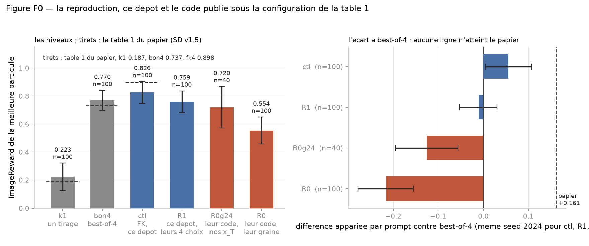
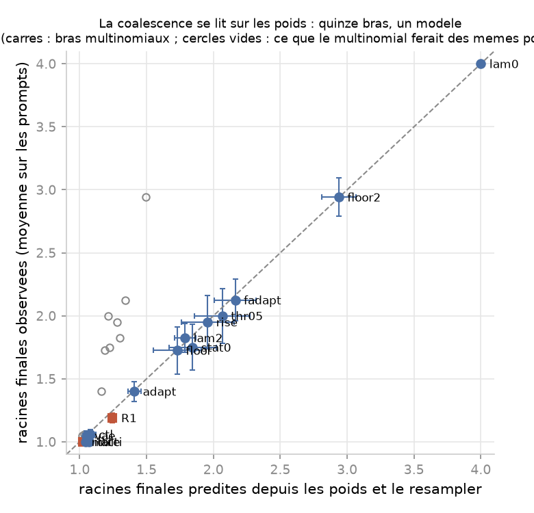
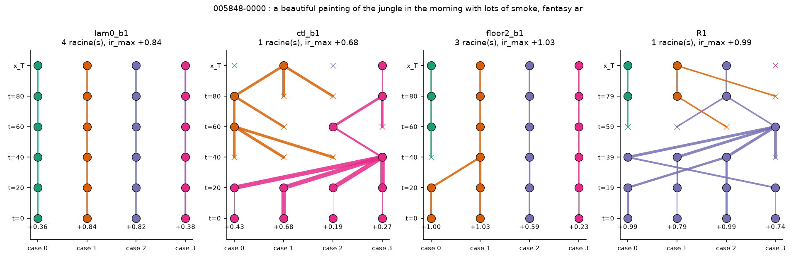
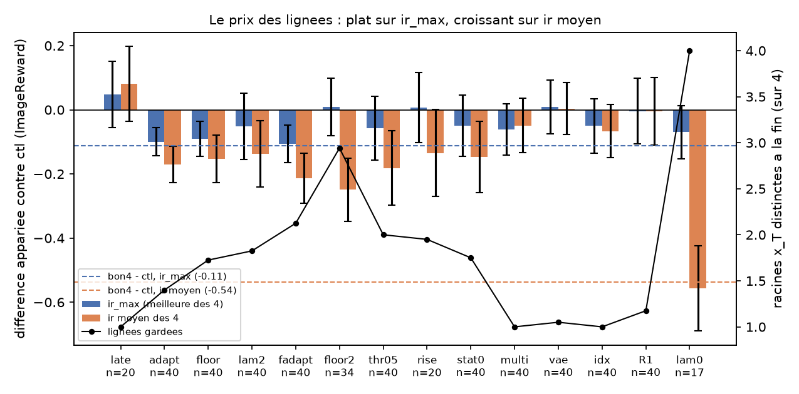
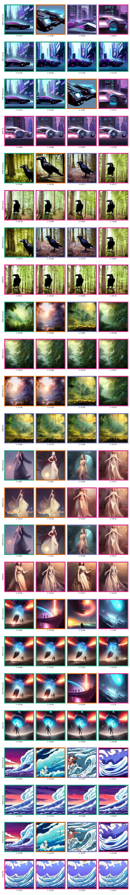
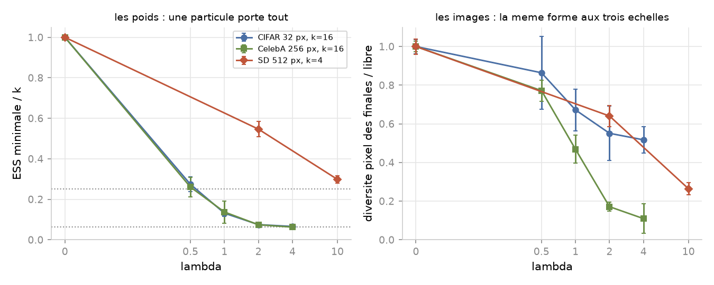

# Reproducing FK Steering on Stable Diffusion, and where the missing 60 % goes

*Draft, pass 7 (23/09). Every number traces to a block of `docs/results.md`; the
figures are rebuilt from the JSON by the script named under each.*

## 1. What FK Steering claims

Sampling a diffusion model gives you a draw from $p(x)$. Often you want a draw
from a distribution tilted toward something you can score: prompt alignment, an
aesthetic preference, a classifier's output. Fine-tuning is one answer. FK
Steering (Singhal et al., *A General Framework for Inference-time Scaling and
Steering of Diffusion Models*, ICML 2025, arXiv 2501.06848) is another, and it
changes nothing about the model. It runs $k$ particles down the denoising
trajectory together, scores them at a few intermediate steps, and resamples the
cloud toward the ones that score well, which targets

$$\pi(x) \;\propto\; p(x)\, e^{\lambda\, r(x)}$$

as a Feynman-Kac particle system. The reward is defined on clean images, and at
step $t$ there is no clean image, so the score is read on the Tweedie estimate
$\hat x_0$, the model's own guess at where the trajectory is going. The
bookkeeping that makes this a valid target rather than a heuristic is the
product constraint: the potentials $G_t$ applied along a surviving lineage have
to multiply to $e^{\lambda r(x_0)}$, and the paper gives three that do, called
DIFFERENCE, MAX and SUM.

The comparison that matters is against best-of-$N$: same number of network
evaluations, spent on $N$ independent trajectories with the winner picked at the
end, or on $k$ trajectories that talk to each other on the way down. Table 1 of
the paper says that on Stable Diffusion
v1.5 with ImageReward, at $\lambda = 10$, $k = 4$, MAX potential and five
scheduled steps, FK reaches 0.898 against 0.737 for best-of-4 and 0.187 for a
single sample. That +0.161 over best-of-4 is the number this post is about.

## 2. The reproduction

Everything here is written from the equations in plain PyTorch, against two
baselines that do not go through the particle filter at all. The setting is the
paper's: SD v1.5 in fp16, DDIM with $\eta = 1$, 100 steps, guidance 7.5, 512 px,
the 100 prompts of the ImageReward benchmark, three seeds (2024, 2025, 2026),
one generator seeded per prompt so no two prompts share an $x_T$. Three hundred
runs per row.

| | ImageReward | HPS v2.1 | paper (IR / HPS) |
|---|---|---|---|
| one sample | 0.237 ± 0.082 | 0.245 | 0.187 / 0.245 |
| best-of-4 | 0.758 ± 0.069 | 0.258 | 0.737 / 0.265 |
| FK, $k = 4$ | 0.820 ± 0.069 | 0.259 | 0.898 / 0.263 |

Every interval in this post is computed over the 100 prompts, with the three
seeds of a prompt averaged before anything else: the three seeds of one prompt
are not three independent observations of what the method does. Read over the
300 runs instead, the same standard errors read 0.056, 0.043 and 0.044.

The two baselines land on the paper. The FK row does not. Read paired, which is
the right way since every FK run shares its four initial noises with the
best-of-4 run on the same prompt and seed, the gain is **+0.062 ± 0.026** with
69 of 100 prompts won, against the paper's +0.161. A bootstrap over prompts
(10 000 draws, seeds averaged within a prompt first) gives a 95 % interval of
[+0.008, +0.109], so the gain is separated from zero and about 60 % of it is
missing.

Two things are worth stating before the diagnosis. The budget is counted, not
assumed: a forward hook on the UNet records how many sample rows cross it, and
both rows read exactly 800 on all 600 runs, against 200 for a single sample. And
the wall clock is not matched even when the rows are. FK takes 62.5 s per run
against 56.1 s, a ratio of 1.113, because it also decodes and scores five times
per particle. At equal wall clock the honest baseline is best-of-4.45, not
best-of-4.

**The reference run.** A reproduction that misses a number has to say whether the
configuration or the code is the difference, so both were run. The paper's text
states its SD configuration in full: MAX potential, schedule $[0, 20, 40, 60, 80]$
with 0 the terminal step, $\lambda = 10$, $k = 4$, DDIM with $\eta = 1$ and 100
steps, guidance 7.5, ImageReward read on the Tweedie estimate. That is this
repository's configuration. The released evaluation script defaults to another
one, the DIFFERENCE potential on a 5-30-5 schedule, which the paper's own
appendix scores lower. What the released code does and the text does not say
comes down to four implementation choices: the running maximum is floored at 0,
so a step where all four rewards are negative carries flat weights; the
resampler is multinomial and runs at every scheduled step, flat weights
included; the final population is resampled once more if its ESS falls under
$k/2$; and the guide decodes with the pipeline's VAE. The four were put into this
repository's filter by wrappers, and the released code ran from its own clone.

| row | code | ImageReward | against best-of-4 |
|---|---|---|---|
| paper, Table 1 | | 0.898 | +0.161 |
| this repository, its own choices (`ctl`: the FK row regenerated on 21/09 with the current code, 100 prompts, seed 2024) | `smc/` | 0.826 | +0.056 ± 0.052 |
| this repository with the four choices (`R1`, 100 prompts) | `smc/` | 0.756 | -0.011 ± 0.041 |
| released code, same $x_T$ as the rows above (40 prompts) | theirs | 0.720 | -0.126 ± 0.070 |
| released code, its own seeding (100 prompts) | theirs | 0.554 | -0.216 ± 0.061 |

The released code without its filter returns best-of-4's four rewards to the
fourth decimal when handed the same generator, and its ImageReward scorer agrees
with the official one to the third decimal, so the two implementations start from
the same images and score them the same way. Under the paper's configuration
neither of them returns the paper's number on this material, and the four
choices that separate them cost the whole edge over best-of-4 rather than adding
to it. The gap is bounded, not closed, and it does not live in the
implementation.

## 3. Where the missing 60 % goes

**It is not a bug.** The product constraint holds on the three potentials in
`tests/test_fk.py`; the SD wrapper draws the same $x_T$ as the diffusers pipeline
at the bit and follows it at a correlation of 0.98 or more to the last step at
$\lambda = 0$; the budget is the measured 800 rows on both rows. Two more
suspects die on the data. The decoder is not the story: the guide decodes with
`sd-vae-ft-mse` and the final images with the pipeline's own VAE, and the same
particle comes first under both in 225 of 300 runs. The particles are not
failing to diverge either: no FK run ends with two bit-identical ImageReward
scores, and only 9 of 300 have two that agree to three decimals.

**The cloud collapses, early.** The paper's schedule puts its first scheduled
step at $t = 80$, which is twenty of the hundred denoising steps in, when the
Tweedie estimate is still a blur. The median ESS there is **1.18 out of 4**. At
the terminal step it is 2.78: the weights are well spread once the image is
sharp, which is when they have almost nothing left to select from. With
$\lambda = 10$ on a reward whose useful range spans about two units, a gap of
0.2 in early ImageReward is a weight ratio of $e^2$, which is harmless at the
last step and destructive at step 20.

**`ir_max` cannot see what this costs.** Four copies of one image score exactly
like four images. Two fields say what the score cannot: `n_lineages`, the number
of distinct $x_T$ still represented among the $k$ finals, recovered by walking
the ancestor indices backwards; and `div_pix`, the mean pairwise RMSE of the
finals at 64 x 64. Regenerated on the 100 prompts with these fields, FK at the
paper's setting ends on **one lineage out of four in 96 runs of 100** and on two
in the other four, with `div_pix` 0.091 against best-of-4's 0.327 on the 20 where
both were measured. The four images an FK run returns are one image. The
per-prompt gain has a heavy left tail for the same reason: its worst prompt sits
at -1.30 over three seeds because the particle that would have won was killed at
step 20.

**What the ESS does not predict.** The runs with the lowest ESS are not the runs
that lose: across the 300 runs the Spearman correlation between the ESS at the
first scheduled step and the paired gain over best-of-4 is **+0.018**, and the
three ESS terciles give median gains of +0.060, +0.042 and +0.083. The ESS is the
wrong quantity to ask, and the next two paragraphs say which one is right.

**Two degeneracies, not one.** The ESS measures how unequal the weights are at
one step. What kills the cloud is a different thing, the degeneracy of the paths:
each resampling copies some particles and drops others, and after a few passes
every survivor descends from the same ancestor whatever the weights did in
between. The two are separable on this data. An arm that bisects $\lambda$ at
every step so that the ESS is held at exactly 2 of 4 still ends on 1.4 roots, 60 %
of its runs on a single one. And the count of surviving roots can be predicted
without knowing anything about the steering: replaying the recorded weights of
each run through the resampler, with the systematic comb integrated over its
offset, gives the mean number of final roots of fifteen different arms within
0.07 and their single-root fraction within three points. For one arm the
prediction was written down before the arm ran, 1.84 roots against the plan's
guess of 2.4 to 2.8, and the arm came out at 2.00.
Under flat weights the comb is the identity and the multinomial draw the
released code uses is not: four flat passes at $k = 4$ leave 1.6 roots of 4 by
pure chance, before any reward has spoken.

**The target does the rest.** Take best-of-4's four free draws and reweight them
by $e^{10\, r}$: the median ESS is 1.23. At $\lambda = 10$ the target
$p(x)\, e^{\lambda r(x)}$ restricted to four candidates puts about 90 % of its
mass on one of them. Four particles cannot carry diversity at this $\lambda$,
whatever the kernel, the potential or the schedule does; what FK adds on top is
to pick that one candidate at $t = 80$, on a blurred estimate whose reward moves
by more than a unit when the decoder changes, so that the choice reads noise.
How much the choice reads was measured once, on the one pairing that holds: the
free run and the FK run of each prompt in the same process, so that slot $j$ of
the free run is what root $j$ becomes when nobody touches it. The ranking of the
four rewards at $t = 80$ predicts the ranking of the four free outcomes with a
Kendall $\tau$ of **+0.14 ± 0.05**, and picks the best root in 35 % of prompts
against 25 % by chance: a little, not nothing. Read on the free outcomes, the best
of the four roots scores 0.78, an average root 0.23, and the root FK keeps 0.47,
one third of the way from average to best; what FK then makes of that root is
0.80. The collapse costs 0.31 of root, the steering returns 0.33, and the
difference over best-of-4 is the 0.02 that is left.

## 4. Ablation of the schedule

Seven single-knob changes to the paper's setting were screened on the first 20
prompts, paired to the same four initial noises. Three lambdas (2, 5, 20) all
lose to 10 on the paired difference against FK; dropping the first scheduled
step (`S60`, schedule $[0, 20, 40, 60]$) doubles the gain over best-of-4 on the
screen; dropping two (`S40`) gives part of it back; resampling only under
ESS $< k/2$ gains a little for a different reason, letting weights carry across
a step. The ESS at whichever step comes first reads 1.18, 1.03, 1.05: the
collapse follows the first evaluation, not the clock, and a change of schedule
moves where it happens rather than whether.

The screen ranks and does not settle, so `S60` went to 100 prompts and three
seeds, with three readings fixed in advance. Against best-of-4 it lands at
**+0.1005 ± 0.0311**, 64 prompts of 100 won, the strongest paired result of the
project. Against the paper's schedule it lands at +0.0386 ± 0.0351, inside the
band the protocol had labelled not settled, and the ImageReward it reaches,
0.858, is still 0.040 under the paper's 0.898. It does not touch the collapse:
258 of 300 runs end on one lineage, 1.14 of 4 on average. Removing the
uninformative step is the one change in this post that costs nothing on the
reward, one reward evaluation per particle fewer in fact, and it repairs nothing
about the cloud.

## 5. Repairing the collapse, and what it costs

Fifteen arms tried to keep the cloud alive, each pre-registered with a
prediction and paired to the reference on 20 to 40 prompts. Two time-dependent $\lambda$ ramps
under two placements move ImageReward by nothing, all eight differences inside
one standard error of zero, and the quadratic ramp with an ESS threshold doubles
the lineages to 2.05 of 4 by resampling once per run instead of four times. A
$\lambda$ bisected at every step to hold the ESS at $k/2$ ends on 1.4 roots. The
released code's floor at 0 makes the first step inert in 90 % of runs and ends
on 1.7 roots, because the collapse resumes one step later. Resampling only under
ESS $< k/2$ with that floor resamples once per run and still ends on 2.0 roots,
which the coalescence model had predicted at 1.84 against the plan's guess of
2.4 to 2.8: when the threshold finally fires, the accumulated weights are
peaked and one pass takes almost everything. Only one arm passes the criterion
fixed before the runs, fewer than a quarter of runs on a single root: the floor
together with $\lambda = 2$, at 5 % single-root, 3.0 roots of 4 and `div_pix`
0.286 against 0.092. It does so by changing the target, and it returns the
diversity that target carries, no more.

**The price is flat on the score and steep on the cloud.** Every arm that keeps
lineages returns `ir_max` to best-of-4's level: pooled over the seven
corrections the paired difference against the reference is -0.069, interval
[-0.176, +0.041] over prompts, and each of them sits within 0.06 of best-of-4.
The mean reward of the four images tells the other half: it falls by 0.15 to
0.56 in the order of the roots kept, down to the free model's -0.56. Under
collapse the four images are one good image scored four times; with the
lineages back, they are four images, and three of them are worse. The edge FK
has over best-of-4 is the concentration, and making the concentration
reversible costs exactly that edge.

## 6. The judge, and the same shape at three scales

A gain on the reward that guides is worth what the reward is worth, so this
project ran the same machinery on three rewards of decreasing gameability and
watched a second metric each time.

**A reward that can be gamed.** The first reward on CIFAR-10 is a redness score
on channel means that cannot exceed 10.19 on pixels inside $[-1, 1]$. Under the
SUM potential FK reaches 11.16 at $\lambda = 4$: the images have left $[-1, 1]$
and are flat red squares, to which the independent judge $B$ gives a mean
$p(\text{cat})$ of **0.54**, against 0.27 for the free model. The reward went up,
the images stopped being images, and the judge got more confident.

**A reward with an independent judge.** With $r(x) = \log p_A(\text{cat} \mid x)$
and the DIFFERENCE potential, the product telescopes to
$p(x)\, p_A(\text{cat} \mid x)^{\lambda}$, so $\lambda = 1$ is exactly the Bayes
posterior under the guide $A$, a small VGG at 89.4 %. A second classifier $B$, a
ResNet-18 at 93.2 % calibrated to temperature 1.82, only ever judges. At
$k = 16$ over three seeds, the log-probability of the drawn particle goes from
-8.29 free to -0.48 at $\lambda = 1$ and -0.16 at $\lambda = 4$, while the
minimum ESS falls from 16 to 2.1 and then to 1.05.

$B$ counts 11 cats among the 48 finals of the free model, 15 at $\lambda = 1$,
32 at $\lambda = 2$ and 37 at $\lambda = 4$, over three seeds because one seed
at $k = 16$ reads 10, 0 and 5 of 16. What the rising count costs is in the same
tensors: the mean pairwise pixel distance between the sixteen finals falls from
0.339 to 0.231 at $\lambda = 1$ and 0.183 at $\lambda = 4$, where the minimum
ESS of 1.05 says the sixteen descend from one ancestor. It is the collapse of
section 3 at a second scale, on a different reward.

**A reward nobody claims to have solved.** On SD with ImageReward, the second
metric is HPS v2.1, read at the particle ImageReward selected so the judge is
not scored on its own favourite. The paired difference between FK and best-of-4
is **+0.0015 ± 0.0011**, 50 prompts of 100 won; the paper's own table has FK
slightly below best-of-4 on HPS. The +0.062 is a gain on the guiding reward, and
the metric nobody optimised did not move.

Three scales, the same shape: what the reward measures improves, and the further
a second metric sits from the reward, the less of the improvement reaches it.
The collapse has the same shape at the three scales too. The minimum ESS over a
run, divided by $k$, falls from 1 to 0.066 on CIFAR and to 0.063 on CelebA
between $\lambda = 0$ and 4, and to 0.30 on SD at $\lambda = 10$ with only five
scheduled steps; the pixel diversity of the finals, relative to the free model,
falls to 0.52, 0.11 and 0.26.

## 7. What was verified, and how

**The mathematics, as tests.** The product constraint is a property, not a
shape, and it is tested as one: along a surviving lineage the potentials
multiply to $e^{\lambda r(x_0)}$, for the three potentials, and at $\lambda = 0$
the system is the free model. The resamplers are tested against the `particles`
library as an oracle, with a statistical tolerance for the multinomial and the
strict $2/k$ bound the systematic comb guarantees.

**The wrapper, against the library it wraps.** At $\lambda = 0$ the SD path
through the particle filter draws the pipeline's $x_T$ at the bit and follows its
trajectory at a correlation of 0.984 or more to the last step; the one input that
differs is the text embedding, encoded once and expanded rather than four times
in a batch, by 1.6e-2 in fp16. That is what makes the $\lambda > 0$ comparison a statement
about steering rather than about two different samplers, and it is also why the
ImageReward of one slot can differ by 0.3 between the two paths at the end.

**What does not reproduce.** The diffusers pipeline and the wrapper at
$\lambda = 0$ both return the best-of-4 rewards written on 20/09, slot by slot,
three days later. The wrapper with resampling does not: it returns identical
numbers within one process and different surviving roots from one day's session
to the next, with the same code and weights. The suspect is the guide's reward
in fp16, where a difference at the third decimal is enough to move one tooth of
a four-tooth comb, and the cause was not pinned down in the time available. Every
paired comparison in this post is therefore paired by prompt, or by $x_T$
within one session, and never by slot across files written on different days.

**The budget, as a measurement.** A forward hook on the UNet counts calls and
sample rows. The $k$ particles cross the UNet in one batched forward, so the
call counter reads 100 for every configuration and only the row counter
separates them.

**One bug worth naming.** An earlier schedule silently dropped the terminal
step, which breaks the product constraint without breaking anything visible.
`fk_steer` now refuses such a schedule, and every bug that cost more than twenty
minutes is in `LEARNING.md` with its cause and the rule it produced.

## 8. Limits, and how this was made

**What is not claimed.** Adaptive resampling on an ESS threshold is textbook
(Chopin and Papaspiliopoulos, ch. 10) and is sketched in the paper's own
appendix. Paying a time-dependent $\lambda$'s deficit at every step is the
textbook Feynman-Kac sequence $G_t = \pi_t / \pi_{t-1}$ (ch. 17). Both are
implemented and measured here; neither is offered as a contribution.

**What is weak.** The released code was run under this repository's diffusers
0.31 rather than the development commit it pins, on 100 prompts with its own
seeding and 40 with ours, and one seeding path of its filter scores 0.31 under
the other for no reason found. The paper does not say which VAE decoded its
images, and this one uses `sd-vae-ft-mse` for the guide; on the same four
particles the pipeline's VAE moves one first-step reward by 1.2. The runs do not keep the images, so any
image-level metric has to be decided before the GPU night and not after.
`div_pix` is a pixel proxy that separates four copies from four images and
nothing more. The CIFAR and CelebA numbers carry standard deviations over three
seeds, not over prompts, and support the mechanism rather than the headline. Two
of the fifteen SD arms lost six of their forty records to a rerun that
overwrote them, and are read at 34. Everything ran on one 16 GB T4.

**How this was made.** The Sequential Monte Carlo core, the weights, the
resamplers, the three potentials, the Feynman-Kac loop, the model wrappers and
every test that checks a mathematical property of those objects were written by
the author, under a code contract fixed in writing before the code existed: an
assistant was used for plumbing (argparse, figures, launcher scripts, the S3 and
environment scripts), for review, for pointers into the papers and into
Chopin and Papaspiliopoulos, and for the analysis scripts of the collapse lab
that read the recorded runs, drive the released code from its own clone and
draw the figures, and never for the core. The contract, the decisions with their
reasons, the chronology and the protocol with its dated predictions are in the
repository, which is what makes the claim checkable.
