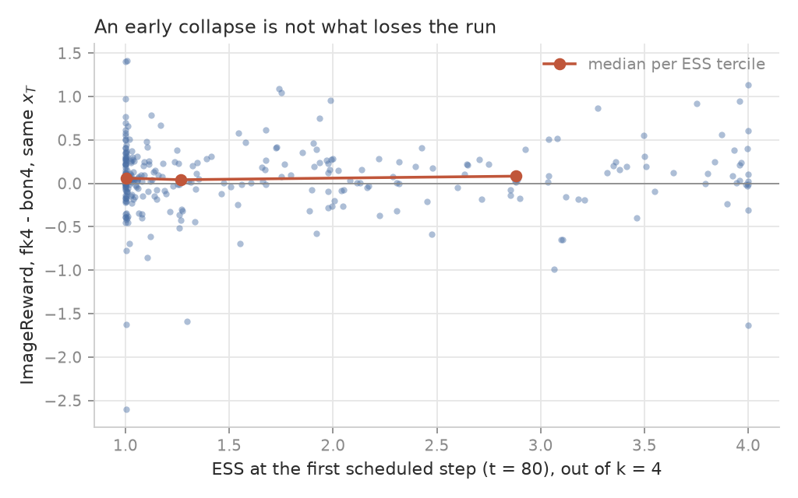

# Reproducing FK Steering on Stable Diffusion, and where the missing 60 % goes

*Draft. Sections 4 and 5 wait on two GPU nights; the holes are marked.*

## 1. What FK Steering claims

Sampling a diffusion model gives you a draw from $p(x)$. Often you want a draw
from a distribution tilted toward something you can score: prompt alignment, an
aesthetic preference, a classifier's output. Fine-tuning is one answer. FK
Steering (Singhal et al., *A General Framework for Inference-time Scaling and
Steering of Diffusion Models*, ICML 2025, arXiv 2501.06848) is another, and it
changes nothing about the model. It runs $k$ particles down the denoising
trajectory together, scores them at a few intermediate steps, and resamples the
cloud toward the ones that score well, which targets

$$\pi(x) \;\propto\; p(x)\, e^{\lambda\, r(x)}$$

as a Feynman-Kac particle system. The reward is defined on clean images, and at
step $t$ there is no clean image, so the score is read on the Tweedie estimate
$\hat x_0$, the model's own guess at where the trajectory is going. The
bookkeeping that makes this a valid target rather than a heuristic is the
product constraint: the potentials $G_t$ applied along a surviving lineage have
to multiply to $e^{\lambda r(x_0)}$, and the paper gives three that do, called
DIFFERENCE, MAX and SUM.

The comparison that matters is against best-of-$N$. Both spend the same number
of network evaluations; best-of-$N$ spends them on $N$ independent trajectories
and picks the winner at the end, FK spends them on $k$ trajectories that talk to
each other on the way down. Table 1 of the paper says that on Stable Diffusion
v1.5 with ImageReward, at $\lambda = 10$, $k = 4$, MAX potential and five
scheduled steps, FK reaches 0.898 against 0.737 for best-of-4 and 0.187 for a
single sample. That +0.161 over best-of-4 is the number this post is about.

## 2. The reproduction

Everything here is written from the equations in plain PyTorch, against two
baselines that do not go through the particle filter at all. The setting is the
paper's: SD v1.5 in fp16, DDIM with $\eta = 1$, 100 steps, guidance 7.5, 512 px,
the 100 prompts of the ImageReward benchmark, three seeds (2024, 2025, 2026),
one generator seeded per prompt so no two prompts share an $x_T$. Three hundred
runs per row.

| | ImageReward | HPS v2.1 | paper (IR / HPS) |
|---|---|---|---|
| one sample | 0.237 ± 0.082 | 0.245 | 0.187 / 0.245 |
| best-of-4 | 0.758 ± 0.069 | 0.258 | 0.737 / 0.265 |
| FK, $k = 4$ | 0.820 ± 0.069 | 0.259 | 0.898 / 0.263 |

Every interval in this post is computed over the 100 prompts, with the three
seeds of a prompt averaged before anything else: the three seeds of one prompt
are not three independent observations of what the method does. Read over the
300 runs instead, the same standard errors read 0.056, 0.043 and 0.044.

The two baselines land on the paper. The FK row does not. Read paired, which is
the right way since every FK run shares its four initial noises with the
best-of-4 run on the same prompt and seed, the gain is **+0.062 ± 0.026** with
69 of 100 prompts won, against the paper's +0.161. A bootstrap over prompts
(10 000 draws, seeds averaged within a prompt first) gives a 95 % interval of
[+0.008, +0.109], so the gain is separated from zero and about 60 % of it is
missing.

Two things are worth stating before the diagnosis. The budget is counted, not
assumed: a forward hook on the UNet records how many sample rows cross it, and
both rows read exactly 800 on all 600 runs, against 200 for a single sample. And
the wall clock is not matched even when the rows are. FK takes 62.5 s per run
against 56.1 s, a ratio of 1.113, because it also decodes and scores five times
per particle. At equal wall clock the honest baseline is best-of-4.45, not
best-of-4.

## 3. Where the missing 60 % goes

**It is not a bug.** The product constraint holds on the three potentials in
`tests/test_fk.py`; the SD wrapper reproduces the diffusers pipeline bit for bit
at $\lambda = 0$; the budget is the measured 800 rows on both rows. Two more
suspects die on the data. The decoder is not the story: the guide decodes with
`sd-vae-ft-mse` and the final images with the pipeline's own VAE, and the same
particle comes first under both in 225 of 300 runs. The particles are not
failing to diverge either: no FK run ends with two bit-identical ImageReward
scores, and only 9 of 300 have two that agree to three decimals.

**The cloud collapses, early.** The paper's schedule puts its first scheduled
step at $t = 80$, which is twenty of the hundred denoising steps in, when the
Tweedie estimate is still a blur. The median ESS there is **1.18 out of 4**. At
the terminal step it is 2.78: the weights are well spread once the image is
sharp, which is when they have almost nothing left to select from. With
$\lambda = 10$ on a reward whose useful range spans about two units, a gap of
0.2 in early ImageReward is a weight ratio of $e^2$, which is harmless at the
last step and destructive at step 20.

**`ir_max` cannot see what this costs.** Four copies of one image score exactly
like four images. Two fields say what the score cannot: `n_lineages`, the number
of distinct $x_T$ still represented among the $k$ finals, recovered by walking
the ancestor indices backwards; and `div_pix`, the mean pairwise RMSE of the
finals at 64 x 64. Regenerated on 20 prompts, FK at the paper's setting ends on
**one lineage out of four in 20 of 20 prompts**, with `div_pix` 0.091 against
best-of-4's 0.327. The four images an FK run returns are one image. The
per-prompt gain has a heavy left tail for the same reason. Its worst prompt sits
at -1.30 averaged over its three seeds: best-of-4 draws a +0.92 particle, FK
starts from those same four noises, collapses to ESS 1.00 at the first step, and
ends below even a single free sample on all three seeds. The worst individual
run is -2.60. The particle that would have won was killed at step 20.

**What the ESS does not predict.** The obvious next sentence is that the runs
with the lowest ESS are the runs that lose, and the data does not support it.
Across the 300 runs, the Spearman correlation between the ESS at the first
scheduled step and the paired gain over best-of-4 is **+0.018**, and the three
ESS terciles give median gains of +0.060, +0.042 and +0.083, which is not an
order.

Two thirds of the runs sit between ESS 1.00 and 1.85, so the range is narrow,
and the difference carries best-of-4's variance as well as FK's. Neither excuse
turns a flat cloud into evidence. The claim that survives is narrower and is the
one the rest of the post tests: the collapse is what a change of schedule acts
on, measured as an average over many prompts, and not a per-run predictor of
which prompt FK will lose.

*Hole: the wrong-root rate. `root_slots` records which initial noise each final
particle descends from, so the fraction of runs where the root FK keeps is not
the one best-of-4 would have picked is measurable. It needs the reference run of
night 1 and the check that slot $i$ of the two samplers starts from the same
$x_T$.*

## 4. Ablation of the schedule

*Hole: waits on night 1. Contains the seven-variant screen of 20 prompts (the
schedule is the lever, $\lambda$ is not; the collapse follows the first
evaluation and not the clock, with ESS 1.18 at $t = 80$, 1.03 at $t = 60$ and
1.05 at $t = 40$ whichever step comes first), then `S80` (one selection then
four continuations), `D10` (ten scheduled steps, predicted flat) and the
confirmatory run of `S60` at 100 prompts x 3 seeds. The three readings of that
run are fixed in advance in `docs/protocol_sd.md`.*

## 5. A time-dependent lambda

*Hole: waits on night 2. Contains the two ramps, the distinction between paying
the ramp's deficit at the terminal step and paying it at every scheduled step as
the textbook sequence $G_t = \pi_t / \pi_{t-1}$, the result that no ramp moves
ImageReward, and the diversity result of `T2tA05` carried to 100 prompts x
3 seeds.*

## 6. The judge, and the same shape at three scales

A gain on the reward that guides is worth what the reward is worth, so this
project ran the same machinery on three rewards of decreasing gameability and
watched a second metric each time.

**A reward that can be gamed.** The first reward on CIFAR-10 is a deliberately
simple redness score, $(\bar r - \tfrac{1}{2}(\bar g + \bar b))/0.1962$ on channel
means, which on pixels inside $[-1, 1]$ cannot exceed 10.19. Under the SUM
potential FK reaches 10.90 at $\lambda = 1$ and 11.16 at $\lambda = 4$, so the
images have left $[-1, 1]$; measured at $\lambda = 8$ they span $[-1.26, 1.30]$
and are flat red squares. The independent judge $B$ gives those squares a mean
$p(\text{cat})$ of **0.54** over three seeds, against 0.27 for the free model.
The reward went up, the images stopped being images, and the judge got more
confident, not less.

**A reward with an independent judge.** With $r(x) = \log p_A(\text{cat} \mid x)$
and the DIFFERENCE potential, the product telescopes to
$p(x)\, p_A(\text{cat} \mid x)^{\lambda}$, so $\lambda = 1$ is exactly the Bayes
posterior under the guide $A$, a small VGG at 89.4 %. A second classifier $B$, a
ResNet-18 at 93.2 % calibrated to temperature 1.82, only ever judges. At
$k = 16$ over three seeds, the log-probability of the drawn particle goes from
-8.29 free to -0.48 at $\lambda = 1$ and -0.16 at $\lambda = 4$, while the
minimum ESS falls from 16 to 2.1 and then to 1.05.

$B$'s verdict is the interesting part, and it does not stop at $\lambda = 1$. It
counts 11 cats among the 48 finals of the free model, 15 at $\lambda = 1$, 32 at
$\lambda = 2$ and 37 at $\lambda = 4$. Read one seed at a time the $\lambda = 1$
column is 10 of 16, 0 of 16 and 5 of 16, which is what three seeds at $k = 16$
buy in precision and why the number is given over all three. What the rising
count costs is visible in the same tensors: the mean pairwise pixel distance
between the sixteen finals falls from 0.339 for the free model to 0.231 at
$\lambda = 1$ and 0.183 at $\lambda = 4$. The cats past $\lambda = 1$ are bought
by spending the cloud, and at $\lambda = 4$ the minimum ESS of 1.05 says the
sixteen of them descend from one ancestor. It is the collapse of section 3,
at a second scale and on a different reward.

**A reward nobody claims to have solved.** On SD with ImageReward, the second
metric is HPS v2.1, read at the particle ImageReward selected so the judge is
not scored on its own favourite. The paired difference between FK and best-of-4
is **+0.0015 ± 0.0011**, 50 prompts of 100 won, bootstrap interval
[-0.0005, +0.0036]. The paper's own table has FK slightly below best-of-4 on
HPS. The honest reading is that +0.062 is a gain on the guiding reward and that
the metric nobody optimised did not move.

Three scales, the same shape: what the reward measures improves, and the further
a second metric sits from the reward, the less of the improvement reaches it.

## 7. What was verified, and how

**The mathematics, as tests.** The product constraint is a property, not a
shape, and it is tested as one: along a surviving lineage the potentials
multiply to $e^{\lambda r(x_0)}$, for the three potentials, and at $\lambda = 0$
the system is the free model. The resamplers are tested against the `particles`
library as an oracle, with a statistical tolerance for the multinomial and the
strict $2/k$ bound the systematic comb guarantees.

**The wrapper, against the library it wraps.** At $\lambda = 0$ the SD path
through the particle filter reproduces the diffusers pipeline bit for bit, which
is what makes the $\lambda > 0$ comparison a statement about steering rather than
about two different samplers.

**The budget, as a measurement.** A forward hook on the UNet counts calls and
sample rows. The $k$ particles cross the UNet in one batched forward, so the
call counter reads 100 for every configuration and only the row counter
separates them.

**One bug worth naming.** An earlier schedule silently dropped the terminal
step, which breaks the product constraint without breaking anything visible:
images still come out, ImageReward still improves. `fk_steer` now refuses a
schedule that does not contain the terminal step. Every bug that cost more than
twenty minutes is in `LEARNING.md` with its cause and the rule it produced.

## 8. Limits, and how this was made

**What is not claimed.** Adaptive resampling on an ESS threshold is textbook
(Chopin and Papaspiliopoulos, ch. 10) and is sketched in the paper's own
appendix. Paying a time-dependent $\lambda$'s deficit at every step is the
textbook Feynman-Kac sequence $G_t = \pi_t / \pi_{t-1}$ (ch. 17). Both are
implemented and measured here; neither is offered as a contribution.

**What is weak.** The paper does not say which VAE decoded its images, and this
one uses `sd-vae-ft-mse` for the guide. The runs do not keep the images, so any
image-level metric has to be decided before the GPU night and not after.
`div_pix` is a pixel proxy that separates four copies from four images and
nothing more; `div_clip` is measured in the image encoder that HPS v2.1 was
fine-tuned from, which makes it perceptual and ties it to one of the two judges.
The CIFAR and CelebA numbers carry standard deviations over three seeds, not
over prompts, and they support the mechanism rather than the headline. Everything
ran on one 16 GB T4.

**How this was made.** The Sequential Monte Carlo core, the weights, the
resamplers, the three potentials, the Feynman-Kac loop, the model wrappers and
every test that checks a mathematical property of those objects were written by
the author, under a code contract fixed in writing before the code existed: an
assistant was used for plumbing (argparse, figures, launcher scripts, the S3 and
environment scripts), for review, and for pointers into the papers and into
Chopin and Papaspiliopoulos, and never for the core. The contract, the design
decisions with their reasons, the chronology of what was tried and in what
order, and the protocol with its predictions written before each run are all in
the repository, which is what makes the claim checkable rather than merely
stated.
